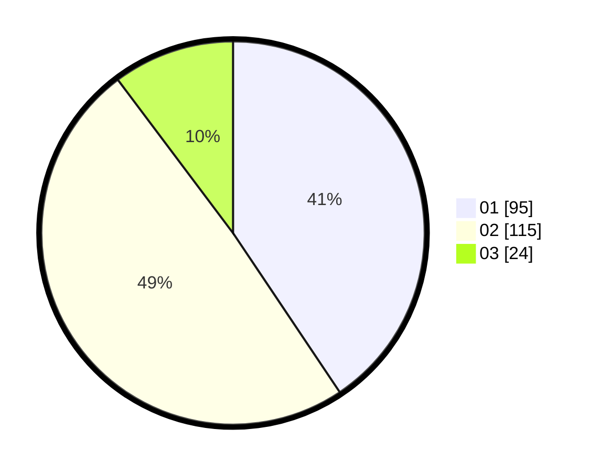

# Hasil

Hasil perolehan suara paslon dapat dilihat pada file paslon-01.txt, paslon-02.txt, dan paslon-03.txt.

Jika tidak ada, artinya data tersebut belum ada pada SIREKAP.

## Perolehan Suara

 * Paslon 01: **95**.
 * Paslon 02: **115**.
 * Paslon 03: **24**.

## Foto C Plano

https://sirekap-obj-formc.kpu.go.id/427c/pemilu/ppwp/31/74/05/10/02/3174051002023-20240216-132124--3efdb7e4-8932-402e-a26d-2cb242bc6dd6.jpg

https://sirekap-obj-formc.kpu.go.id/427c/pemilu/ppwp/31/74/05/10/02/3174051002023-20240216-132125--7b8d82b0-1de3-4eb4-b9e6-d293fae67980.jpg

https://sirekap-obj-formc.kpu.go.id/427c/pemilu/ppwp/31/74/05/10/02/3174051002023-20240216-132124--4f595b5a-7a93-4447-a44a-b82e54c18433.jpg

## DATA PEMILIH TETAP

Jumlah pemilih dalam DPT: **288**.
 * L: **141**.
 * P: **147**.

## DATA PENGGUNA HAK PILIH

Jumlah pengguna hak pilih dalam DPT: **227**.
 * L: **103**.
 * P: **124**.

Jumlah pengguna hak pilih dalam DPTb: **5**.
 * L: **0**.
 * P: **5**.

Jumlah pengguna hak pilih dalam DPK: **5**.
 * L: **2**.
 * P: **3**.

Jumlah pengguna hak pilih: **237**.
 * L: **105**.
 * P: **132**.

## JUMLAH SUARA SAH DAN TIDAK SAH

JUMLAH SELURUH SUARA SAH: **234**.

JUMLAH SUARA TIDAK SAH: **1**.

JUMLAH SELURUH SUARA SAH DAN SUARA TIDAK SAH: **235**.
