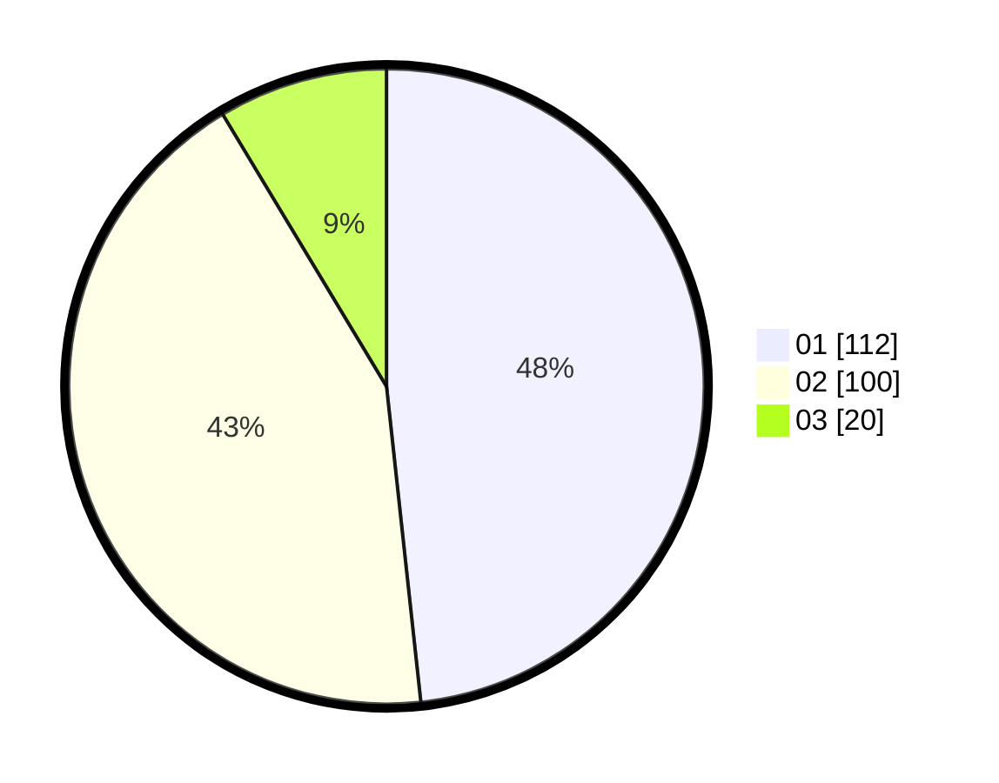

# Hasil

Hasil perolehan suara paslon dapat dilihat pada file paslon-01.txt, paslon-02.txt, dan paslon-03.txt.

Jika tidak ada, artinya data tersebut belum ada pada SIREKAP.

## Perolehan Suara

 * Paslon 01: **112**.
 * Paslon 02: **100**.
 * Paslon 03: **20**.

## Foto C Plano

https://sirekap-obj-formc.kpu.go.id/50fd/pemilu/ppwp/31/74/05/10/02/3174051002034-20240219-175408--3fae090a-fbc6-47cb-af90-dbc59732cf1f.jpg

https://sirekap-obj-formc.kpu.go.id/50fd/pemilu/ppwp/31/74/05/10/02/3174051002034-20240219-175444--6c4c0945-bc47-424e-8549-36352d4332d8.jpg

https://sirekap-obj-formc.kpu.go.id/50fd/pemilu/ppwp/31/74/05/10/02/3174051002034-20240219-175527--6ea770e9-0cce-446e-b67d-d7b4441e2391.jpg

## DATA PEMILIH TETAP

Jumlah pemilih dalam DPT: **296**.
 * L: **150**.
 * P: **135**.

## DATA PENGGUNA HAK PILIH

Jumlah pengguna hak pilih dalam DPT: **270**.
 * L: **725**.
 * P: **115**.

Jumlah pengguna hak pilih dalam DPTb: **2**.
 * L: **1**.
 * P: **2**.

Jumlah pengguna hak pilih dalam DPK: **3**.
 * L: **2**.
 * P: **1**.

Jumlah pengguna hak pilih: **234**.
 * L: **118**.
 * P: **118**.

## JUMLAH SUARA SAH DAN TIDAK SAH

JUMLAH SELURUH SUARA SAH: **232**.

JUMLAH SUARA TIDAK SAH: **804**.

JUMLAH SELURUH SUARA SAH DAN SUARA TIDAK SAH: **236**.
