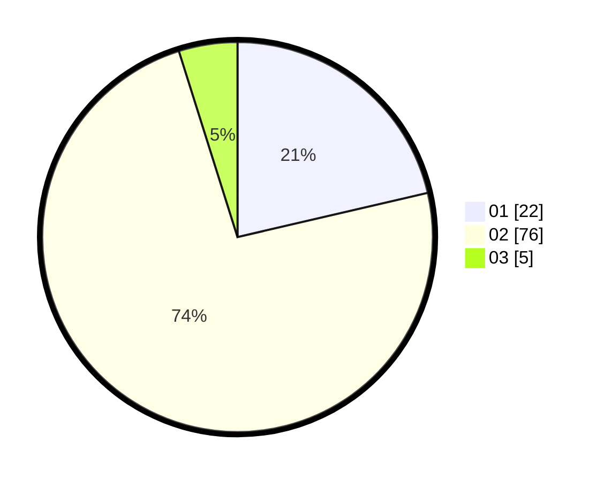

# Hasil

Hasil perolehan suara paslon dapat dilihat pada file paslon-01.txt, paslon-02.txt, dan paslon-03.txt.

Jika tidak ada, artinya data tersebut belum ada pada SIREKAP.

## Perolehan Suara

 * Paslon 01: **22**.
 * Paslon 02: **76**.
 * Paslon 03: **5**.

## Foto C Plano

https://sirekap-obj-formc.kpu.go.id/5ad5/pemilu/ppwp/31/74/05/10/02/3174051002035-20240219-183015--e6f393b9-de7f-4332-bdea-494692267966.jpg

https://sirekap-obj-formc.kpu.go.id/5ad5/pemilu/ppwp/31/74/05/10/02/3174051002035-20240219-182606--36e8ea87-7805-4d91-bdd9-a9e04ea2ebb9.jpg

https://sirekap-obj-formc.kpu.go.id/5ad5/pemilu/ppwp/31/74/05/10/02/3174051002035-20240219-182312--5ac5f23b-c5dd-4d55-8ba7-cc11c06c8b3a.jpg
