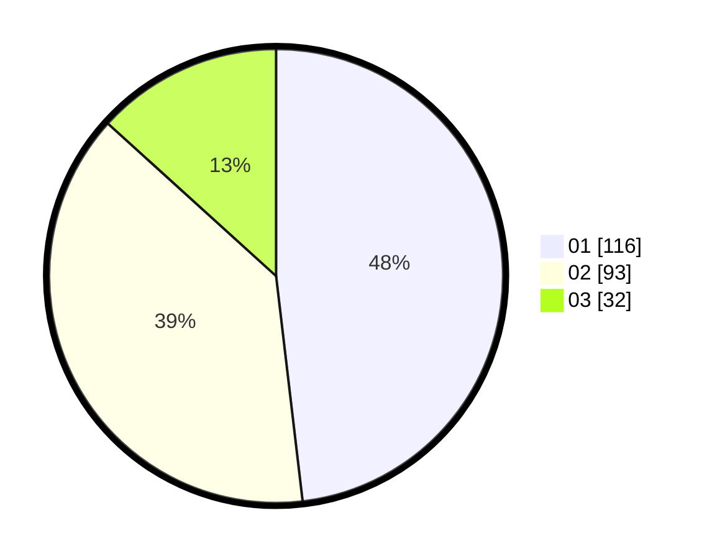

# Hasil

Hasil perolehan suara paslon dapat dilihat pada file paslon-01.txt, paslon-02.txt, dan paslon-03.txt.

Jika tidak ada, artinya data tersebut belum ada pada SIREKAP.

## Perolehan Suara

 * Paslon 01: **116**.
 * Paslon 02: **93**.
 * Paslon 03: **32**.

## Foto C Plano

https://sirekap-obj-formc.kpu.go.id/84fb/pemilu/ppwp/31/74/05/10/02/3174051002036-20240217-222853--31ff1549-e169-4748-8a2c-1a3db0c86233.jpg

https://sirekap-obj-formc.kpu.go.id/84fb/pemilu/ppwp/31/74/05/10/02/3174051002036-20240214-233550--e8bc8c76-35bc-4cf6-86e1-a83206ddcfcd.jpg

https://sirekap-obj-formc.kpu.go.id/84fb/pemilu/ppwp/31/74/05/10/02/3174051002036-20240214-233643--4df7c660-a19f-4bf8-b4f5-d6cd243cde3d.jpg
