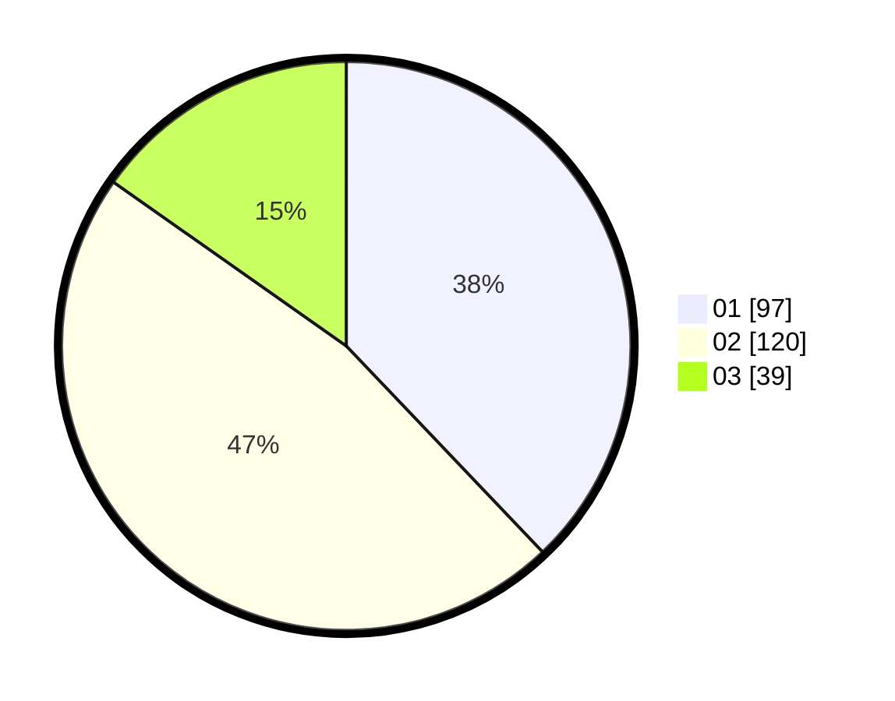

# Hasil

Hasil perolehan suara paslon dapat dilihat pada file paslon-01.txt, paslon-02.txt, dan paslon-03.txt.

Jika tidak ada, artinya data tersebut belum ada pada SIREKAP.

## Perolehan Suara

 * Paslon 01: **97**.
 * Paslon 02: **120**.
 * Paslon 03: **39**.

## Foto C Plano

https://sirekap-obj-formc.kpu.go.id/b4a8/pemilu/ppwp/31/74/05/10/02/3174051002045-20240214-215723--03a7924b-f4a9-4309-ba7f-a5ce65a41346.jpg

https://sirekap-obj-formc.kpu.go.id/b4a8/pemilu/ppwp/31/74/05/10/02/3174051002045-20240214-220024--fdd35757-1251-4f3c-9ba1-9d7889f7a937.jpg

https://sirekap-obj-formc.kpu.go.id/b4a8/pemilu/ppwp/31/74/05/10/02/3174051002045-20240214-220220--a2a1f3e8-d30e-46d5-8c3d-2c2bbfd9e19d.jpg
