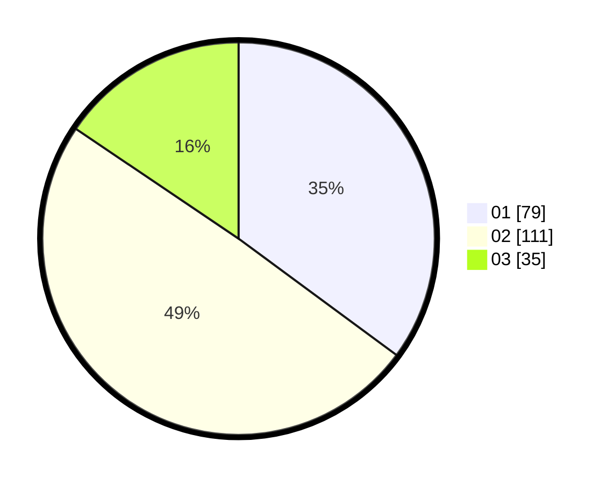

# Hasil

Hasil perolehan suara paslon dapat dilihat pada file paslon-01.txt, paslon-02.txt, dan paslon-03.txt.

Jika tidak ada, artinya data tersebut belum ada pada SIREKAP.

## Perolehan Suara

 * Paslon 01: **79**.
 * Paslon 02: **111**.
 * Paslon 03: **35**.

## Foto C Plano

https://sirekap-obj-formc.kpu.go.id/951d/pemilu/ppwp/31/74/05/10/02/3174051002046-20240214-185104--f44e3b22-9076-4fbe-9e0c-5c6b6477a969.jpg

https://sirekap-obj-formc.kpu.go.id/951d/pemilu/ppwp/31/74/05/10/02/3174051002046-20240214-202405--201c79de-2624-4f33-8b6a-1414b2365e40.jpg

https://sirekap-obj-formc.kpu.go.id/951d/pemilu/ppwp/31/74/05/10/02/3174051002046-20240214-194020--d18744ec-8ab2-45ba-9340-bd9bfceb5583.jpg
