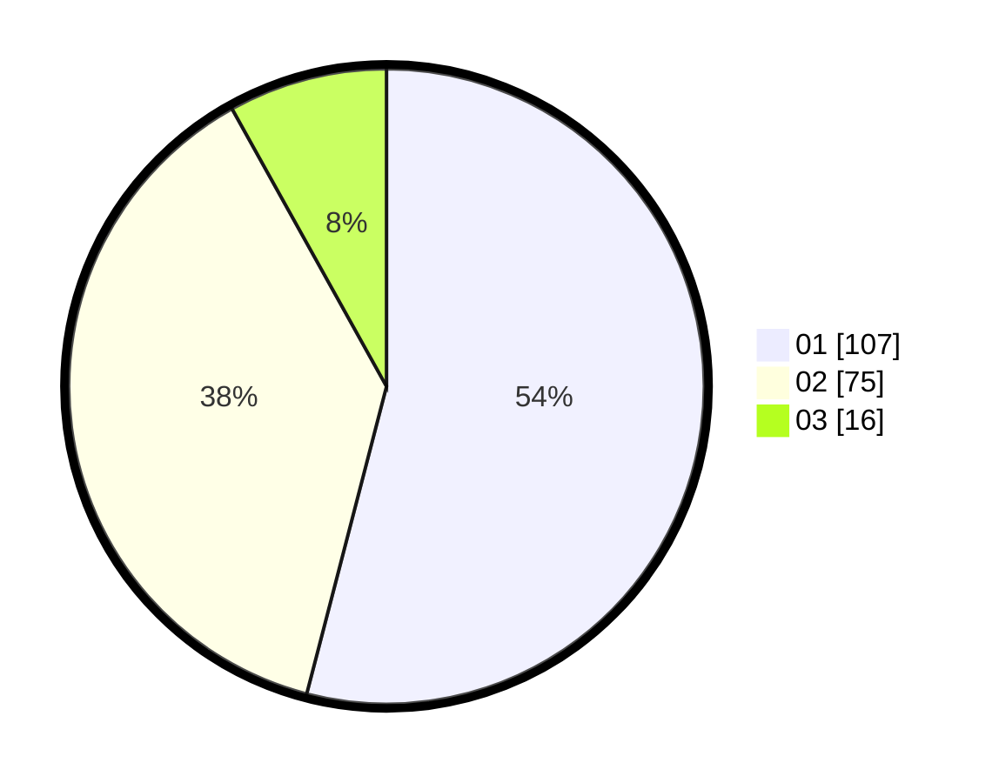

# Hasil

Hasil perolehan suara paslon dapat dilihat pada file paslon-01.txt, paslon-02.txt, dan paslon-03.txt.

Jika tidak ada, artinya data tersebut belum ada pada SIREKAP.

## Perolehan Suara

 * Paslon 01: **107**.
 * Paslon 02: **75**.
 * Paslon 03: **16**.

## Foto C Plano

https://sirekap-obj-formc.kpu.go.id/89d1/pemilu/ppwp/31/74/05/10/02/3174051002047-20240214-155439--5d2351fa-b223-40f9-81cc-cfdc7706d58f.jpg

https://sirekap-obj-formc.kpu.go.id/89d1/pemilu/ppwp/31/74/05/10/02/3174051002047-20240214-155638--800038dc-95c2-4c9a-bba9-977da9ce582b.jpg

https://sirekap-obj-formc.kpu.go.id/89d1/pemilu/ppwp/31/74/05/10/02/3174051002047-20240214-155721--92a04dcc-b625-4678-ad4d-21709b02b7ad.jpg

## DATA PEMILIH TETAP

Jumlah pemilih dalam DPT: **252**.
 * L: **131**.
 * P: **121**.

## DATA PENGGUNA HAK PILIH

Jumlah pengguna hak pilih dalam DPT: **196**.
 * L: **94**.
 * P: **102**.

Jumlah pengguna hak pilih dalam DPTb: **4**.
 * L: **4**.
 * P: **0**.

Jumlah pengguna hak pilih dalam DPK: **0**.
 * L: **0**.
 * P: **0**.

Jumlah pengguna hak pilih: **200**.
 * L: **98**.
 * P: **102**.

## JUMLAH SUARA SAH DAN TIDAK SAH

JUMLAH SELURUH SUARA SAH: **198**.

JUMLAH SUARA TIDAK SAH: **2**.

JUMLAH SELURUH SUARA SAH DAN SUARA TIDAK SAH: **200**.
