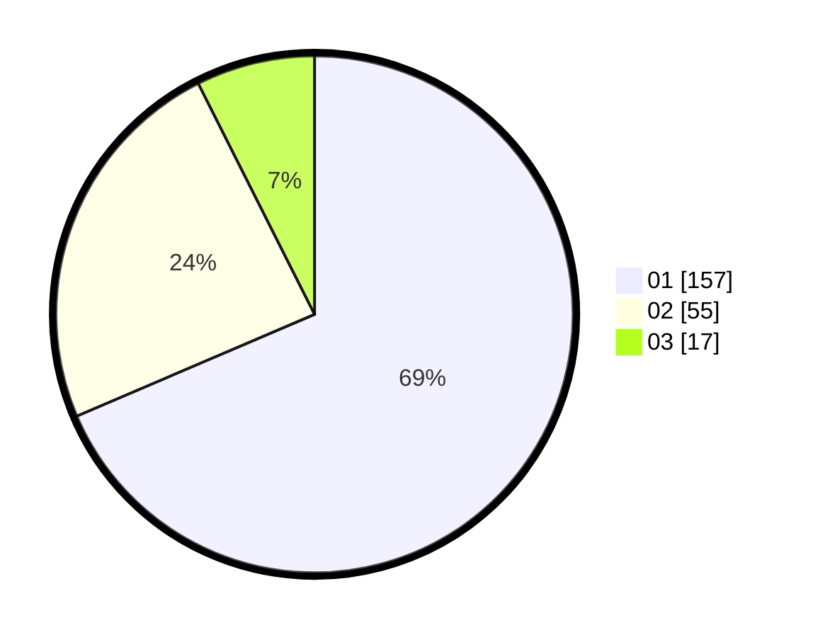

# Hasil

Hasil perolehan suara paslon dapat dilihat pada file paslon-01.txt, paslon-02.txt, dan paslon-03.txt.

Jika tidak ada, artinya data tersebut belum ada pada SIREKAP.

## Perolehan Suara

 * Paslon 01: **157**.
 * Paslon 02: **55**.
 * Paslon 03: **17**.

## Foto C Plano

https://sirekap-obj-formc.kpu.go.id/1fa1/pemilu/ppwp/31/74/05/10/02/3174051002064-20240214-220243--61dd84f4-0ec6-4872-b2fa-3d1d8f61d325.jpg

https://sirekap-obj-formc.kpu.go.id/1fa1/pemilu/ppwp/31/74/05/10/02/3174051002064-20240214-220709--7fa6da38-e0c3-4b4c-b2b2-118947c2f74d.jpg

https://sirekap-obj-formc.kpu.go.id/1fa1/pemilu/ppwp/31/74/05/10/02/3174051002064-20240214-220822--a6eb0213-a1d6-4a26-802f-8000a8ca5c31.jpg

## DATA PEMILIH TETAP

Jumlah pemilih dalam DPT: **262**.
 * L: **133**.
 * P: **129**.

## DATA PENGGUNA HAK PILIH

Jumlah pengguna hak pilih dalam DPT: **218**.
 * L: **107**.
 * P: **111**.

Jumlah pengguna hak pilih dalam DPTb: **11**.
 * L: **2**.
 * P: **9**.

Jumlah pengguna hak pilih dalam DPK: **2**.
 * L: **1**.
 * P: **1**.

Jumlah pengguna hak pilih: **231**.
 * L: **110**.
 * P: **121**.

## JUMLAH SUARA SAH DAN TIDAK SAH

JUMLAH SELURUH SUARA SAH: **229**.

JUMLAH SUARA TIDAK SAH: **2**.

JUMLAH SELURUH SUARA SAH DAN SUARA TIDAK SAH: **231**.
