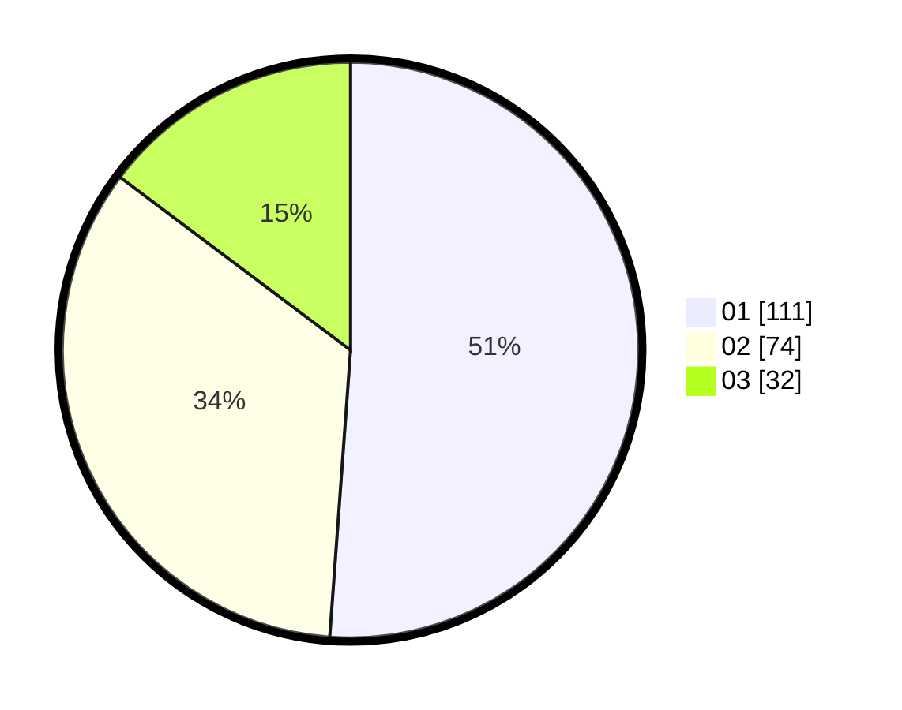

# Hasil

Hasil perolehan suara paslon dapat dilihat pada file paslon-01.txt, paslon-02.txt, dan paslon-03.txt.

Jika tidak ada, artinya data tersebut belum ada pada SIREKAP.

## Perolehan Suara

 * Paslon 01: **111**.
 * Paslon 02: **74**.
 * Paslon 03: **32**.

## Foto C Plano

https://sirekap-obj-formc.kpu.go.id/f266/pemilu/ppwp/31/74/05/10/02/3174051002083-20240216-093156--02686626-5b0e-4469-9c11-1c50317e9d53.jpg

https://sirekap-obj-formc.kpu.go.id/f266/pemilu/ppwp/31/74/05/10/02/3174051002083-20240216-094028--770ce229-a078-41ac-93a5-8a4a6dd1f6bf.jpg

https://sirekap-obj-formc.kpu.go.id/f266/pemilu/ppwp/31/74/05/10/02/3174051002083-20240216-094126--531c90e1-1ce8-410d-8891-827467d8d47b.jpg

## DATA PEMILIH TETAP

Jumlah pemilih dalam DPT: **240**.
 * L: **123**.
 * P: **117**.

## DATA PENGGUNA HAK PILIH

Jumlah pengguna hak pilih dalam DPT: **213**.
 * L: **108**.
 * P: **105**.

Jumlah pengguna hak pilih dalam DPTb: **7**.
 * L: **4**.
 * P: **3**.

Jumlah pengguna hak pilih dalam DPK: **0**.
 * L: **0**.
 * P: **0**.

Jumlah pengguna hak pilih: **220**.
 * L: **112**.
 * P: **108**.

## JUMLAH SUARA SAH DAN TIDAK SAH

JUMLAH SELURUH SUARA SAH: **217**.

JUMLAH SUARA TIDAK SAH: **3**.

JUMLAH SELURUH SUARA SAH DAN SUARA TIDAK SAH: **220**.
