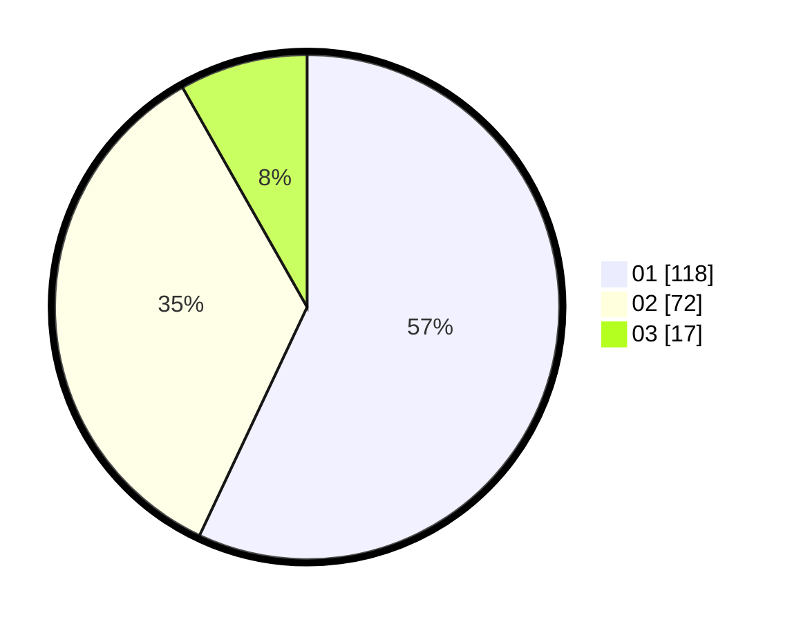

# Hasil

Hasil perolehan suara paslon dapat dilihat pada file paslon-01.txt, paslon-02.txt, dan paslon-03.txt.

Jika tidak ada, artinya data tersebut belum ada pada SIREKAP.

## Perolehan Suara

 * Paslon 01: **118**.
 * Paslon 02: **72**.
 * Paslon 03: **17**.

## Foto C Plano

https://sirekap-obj-formc.kpu.go.id/940e/pemilu/ppwp/31/74/05/10/02/3174051002084-20240214-195418--728ec6c5-93ee-45ad-910b-7280d243ba59.jpg

https://sirekap-obj-formc.kpu.go.id/940e/pemilu/ppwp/31/74/05/10/02/3174051002084-20240214-194820--1b374444-1263-4ab0-862d-5a6ecf2cde4b.jpg

https://sirekap-obj-formc.kpu.go.id/940e/pemilu/ppwp/31/74/05/10/02/3174051002084-20240214-202116--1e00f25d-c295-4bd7-968a-d426aea034e5.jpg

## DATA PEMILIH TETAP

Jumlah pemilih dalam DPT: **221**.
 * L: **113**.
 * P: **108**.

## DATA PENGGUNA HAK PILIH

Jumlah pengguna hak pilih dalam DPT: **196**.
 * L: **102**.
 * P: **94**.

Jumlah pengguna hak pilih dalam DPTb: **11**.
 * L: **4**.
 * P: **7**.

Jumlah pengguna hak pilih dalam DPK: **1**.
 * L: **1**.
 * P: **0**.

Jumlah pengguna hak pilih: **208**.
 * L: **107**.
 * P: **101**.

## JUMLAH SUARA SAH DAN TIDAK SAH

JUMLAH SELURUH SUARA SAH: **207**.

JUMLAH SUARA TIDAK SAH: **1**.

JUMLAH SELURUH SUARA SAH DAN SUARA TIDAK SAH: **208**.
