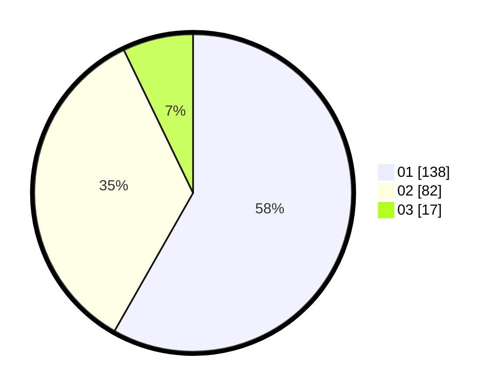

# Hasil

Hasil perolehan suara paslon dapat dilihat pada file paslon-01.txt, paslon-02.txt, dan paslon-03.txt.

Jika tidak ada, artinya data tersebut belum ada pada SIREKAP.

## Perolehan Suara

 * Paslon 01: **138**.
 * Paslon 02: **82**.
 * Paslon 03: **17**.

## Foto C Plano

https://sirekap-obj-formc.kpu.go.id/55b4/pemilu/ppwp/31/74/05/10/02/3174051002088-20240218-124504--e31df08d-092c-4a97-af39-5c823b54ae3c.jpg

https://sirekap-obj-formc.kpu.go.id/55b4/pemilu/ppwp/31/74/05/10/02/3174051002088-20240218-124628--62c89cab-fdfb-4a3c-9079-42072876dc95.jpg

https://sirekap-obj-formc.kpu.go.id/55b4/pemilu/ppwp/31/74/05/10/02/3174051002088-20240218-124635--29f92cfc-eab7-4dc0-86e0-2225613b88b9.jpg

## DATA PEMILIH TETAP

Jumlah pemilih dalam DPT: **263**.
 * L: **132**.
 * P: **131**.

## DATA PENGGUNA HAK PILIH

Jumlah pengguna hak pilih dalam DPT: **236**.
 * L: **120**.
 * P: **116**.

Jumlah pengguna hak pilih dalam DPTb: **4**.
 * L: **0**.
 * P: **4**.

Jumlah pengguna hak pilih dalam DPK: **1**.
 * L: **0**.
 * P: **1**.

Jumlah pengguna hak pilih: **241**.
 * L: **120**.
 * P: **121**.

## JUMLAH SUARA SAH DAN TIDAK SAH

JUMLAH SELURUH SUARA SAH: **237**.

JUMLAH SUARA TIDAK SAH: **4**.

JUMLAH SELURUH SUARA SAH DAN SUARA TIDAK SAH: **241**.
