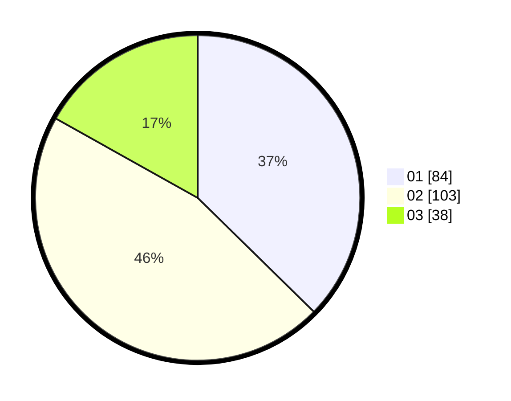

# Hasil

Hasil perolehan suara paslon dapat dilihat pada file paslon-01.txt, paslon-02.txt, dan paslon-03.txt.

Jika tidak ada, artinya data tersebut belum ada pada SIREKAP.

## Perolehan Suara

 * Paslon 01: **84**.
 * Paslon 02: **103**.
 * Paslon 03: **38**.

## Foto C Plano

https://sirekap-obj-formc.kpu.go.id/b608/pemilu/ppwp/31/74/05/10/02/3174051002096-20240219-203717--808b5e0b-ac22-4c4b-a795-a34119d85f62.jpg

https://sirekap-obj-formc.kpu.go.id/b608/pemilu/ppwp/31/74/05/10/02/3174051002096-20240219-204445--659ff50d-252d-43c4-92c9-fb4d12477e09.jpg

https://sirekap-obj-formc.kpu.go.id/b608/pemilu/ppwp/31/74/05/10/02/3174051002096-20240219-204704--ef099a80-5534-4209-ad2a-f11eeae4ec36.jpg

## DATA PEMILIH TETAP

Jumlah pemilih dalam DPT: **262**.
 * L: **145**.
 * P: **117**.

## DATA PENGGUNA HAK PILIH

Jumlah pengguna hak pilih dalam DPT: **214**.
 * L: **110**.
 * P: **104**.

Jumlah pengguna hak pilih dalam DPTb: **15**.
 * L: **6**.
 * P: **9**.

Jumlah pengguna hak pilih dalam DPK: **1**.
 * L: **0**.
 * P: **1**.

Jumlah pengguna hak pilih: **230**.
 * L: **116**.
 * P: **114**.

## JUMLAH SUARA SAH DAN TIDAK SAH

JUMLAH SELURUH SUARA SAH: **225**.

JUMLAH SUARA TIDAK SAH: **5**.

JUMLAH SELURUH SUARA SAH DAN SUARA TIDAK SAH: **230**.
