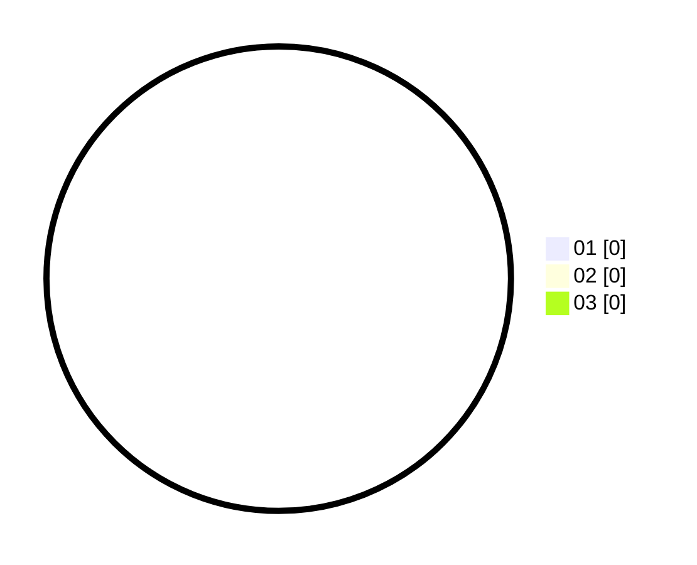

# Hasil

Hasil perolehan suara paslon dapat dilihat pada file paslon-01.txt, paslon-02.txt, dan paslon-03.txt.

Jika tidak ada, artinya data tersebut belum ada pada SIREKAP.

## Perolehan Suara

 * Paslon 01: **0**.
 * Paslon 02: **0**.
 * Paslon 03: **0**.

## Foto C Plano

https://sirekap-obj-formc.kpu.go.id/1772/pemilu/ppwp/31/74/05/10/02/3174051002099-20240214-214804--af2d3a76-8a2b-425c-82b9-76818ee9a6ca.jpg

https://sirekap-obj-formc.kpu.go.id/1772/pemilu/ppwp/31/74/05/10/02/3174051002099-20240214-214808--a8a82e10-9fd0-422b-9e44-9bf9d7363d68.jpg

https://sirekap-obj-formc.kpu.go.id/1772/pemilu/ppwp/31/74/05/10/02/3174051002099-20240214-214813--ac5945bc-ea63-40ab-9dd9-8d3a464eaabc.jpg

## DATA PEMILIH TETAP

Jumlah pemilih dalam DPT: **235**.
 * L: **121**.
 * P: **114**.

## DATA PENGGUNA HAK PILIH

Jumlah pengguna hak pilih dalam DPT: **222**.
 * L: **115**.
 * P: **107**.

Jumlah pengguna hak pilih dalam DPTb: **13**.
 * L: **6**.
 * P: **7**.

Jumlah pengguna hak pilih dalam DPK: **0**.
 * L: **0**.
 * P: **0**.

Jumlah pengguna hak pilih: **235**.
 * L: **121**.
 * P: **114**.

## JUMLAH SUARA SAH DAN TIDAK SAH

JUMLAH SELURUH SUARA SAH: **227**.

JUMLAH SUARA TIDAK SAH: **8**.

JUMLAH SELURUH SUARA SAH DAN SUARA TIDAK SAH: **235**.
