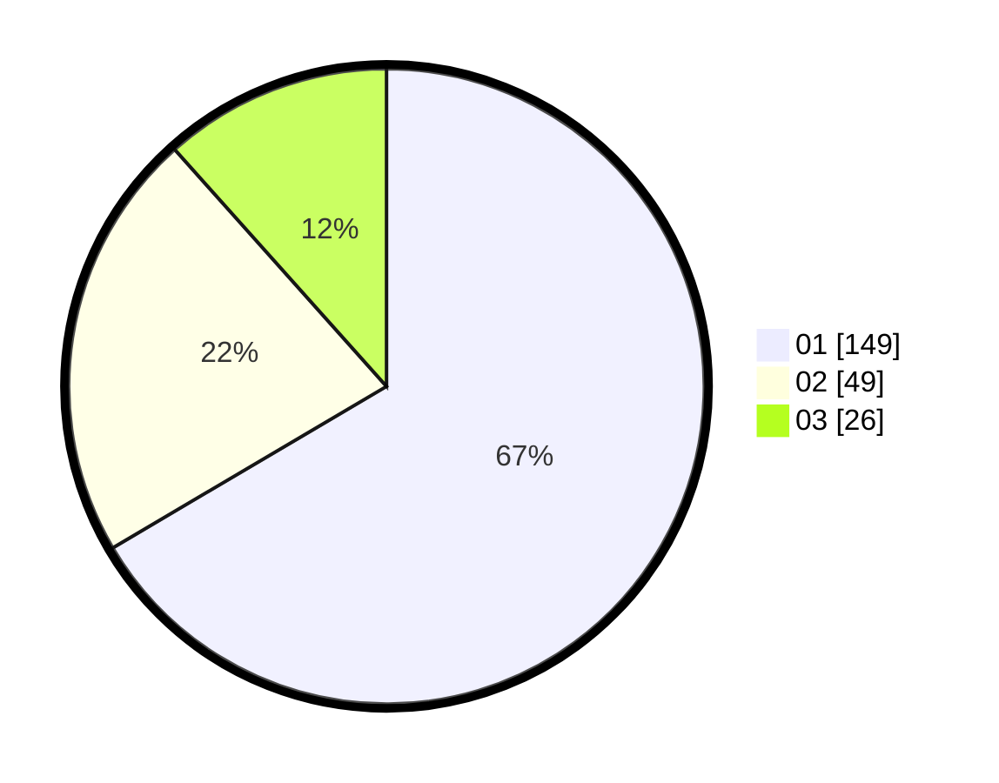

# Hasil

Hasil perolehan suara paslon dapat dilihat pada file paslon-01.txt, paslon-02.txt, dan paslon-03.txt.

Jika tidak ada, artinya data tersebut belum ada pada SIREKAP.

## Perolehan Suara

 * Paslon 01: **149**.
 * Paslon 02: **49**.
 * Paslon 03: **26**.

## Foto C Plano

https://sirekap-obj-formc.kpu.go.id/351e/pemilu/ppwp/31/74/05/10/02/3174051002118-20240214-192212--b3845d38-6c52-4be7-9bc8-6a1a1fb95343.jpg

https://sirekap-obj-formc.kpu.go.id/351e/pemilu/ppwp/31/74/05/10/02/3174051002118-20240214-192450--561529e6-e79e-4e37-9a26-00c569b35730.jpg

https://sirekap-obj-formc.kpu.go.id/351e/pemilu/ppwp/31/74/05/10/02/3174051002118-20240214-192741--9dda6f48-ba20-4cb7-b12b-4ac980befed9.jpg

## DATA PEMILIH TETAP

Jumlah pemilih dalam DPT: **285**.
 * L: **142**.
 * P: **143**.

## DATA PENGGUNA HAK PILIH

Jumlah pengguna hak pilih dalam DPT: **225**.
 * L: **106**.
 * P: **119**.

Jumlah pengguna hak pilih dalam DPTb: **0**.
 * L: **0**.
 * P: **0**.

Jumlah pengguna hak pilih dalam DPK: **4**.
 * L: **1**.
 * P: **3**.

Jumlah pengguna hak pilih: **229**.
 * L: **107**.
 * P: **122**.

## JUMLAH SUARA SAH DAN TIDAK SAH

JUMLAH SELURUH SUARA SAH: **224**.

JUMLAH SUARA TIDAK SAH: **5**.

JUMLAH SELURUH SUARA SAH DAN SUARA TIDAK SAH: **229**.
