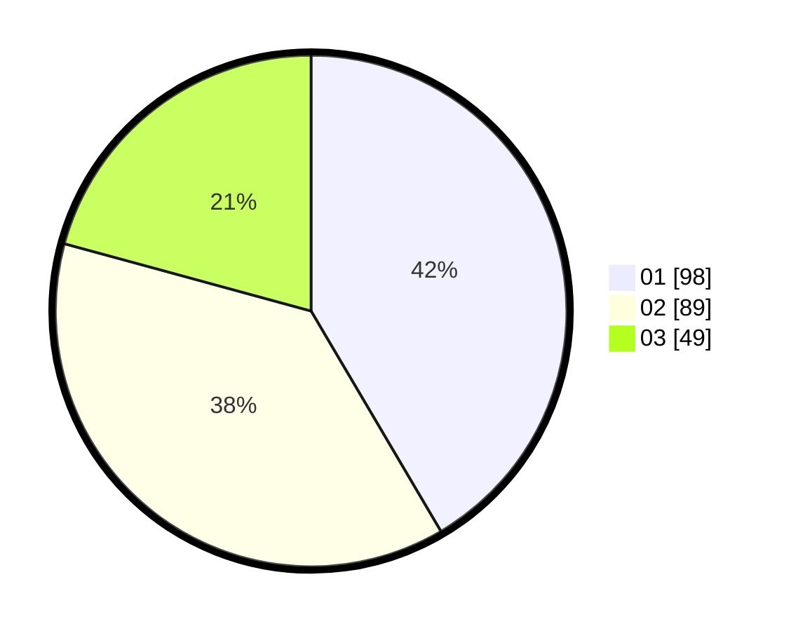

# Hasil

Hasil perolehan suara paslon dapat dilihat pada file paslon-01.txt, paslon-02.txt, dan paslon-03.txt.

Jika tidak ada, artinya data tersebut belum ada pada SIREKAP.

## Perolehan Suara

 * Paslon 01: **98**.
 * Paslon 02: **89**.
 * Paslon 03: **49**.

## Foto C Plano

https://sirekap-obj-formc.kpu.go.id/b9ac/pemilu/ppwp/31/74/05/10/02/3174051002126-20240214-155409--819a6626-f6f5-4f3f-9673-fbdb86e6aa71.jpg

https://sirekap-obj-formc.kpu.go.id/b9ac/pemilu/ppwp/31/74/05/10/02/3174051002126-20240214-155519--891e2886-52ab-4e8f-8ca5-5608c87c49ef.jpg

https://sirekap-obj-formc.kpu.go.id/b9ac/pemilu/ppwp/31/74/05/10/02/3174051002126-20240214-155754--bac9b1df-a6ec-44ba-a12d-6375152ca15b.jpg

## DATA PEMILIH TETAP

Jumlah pemilih dalam DPT: **273**.
 * L: **127**.
 * P: **146**.

## DATA PENGGUNA HAK PILIH

Jumlah pengguna hak pilih dalam DPT: **215**.
 * L: **99**.
 * P: **116**.

Jumlah pengguna hak pilih dalam DPTb: **17**.
 * L: **9**.
 * P: **8**.

Jumlah pengguna hak pilih dalam DPK: **5**.
 * L: **1**.
 * P: **4**.

Jumlah pengguna hak pilih: **237**.
 * L: **109**.
 * P: **128**.

## JUMLAH SUARA SAH DAN TIDAK SAH

JUMLAH SELURUH SUARA SAH: **236**.

JUMLAH SUARA TIDAK SAH: **4**.

JUMLAH SELURUH SUARA SAH DAN SUARA TIDAK SAH: **240**.
