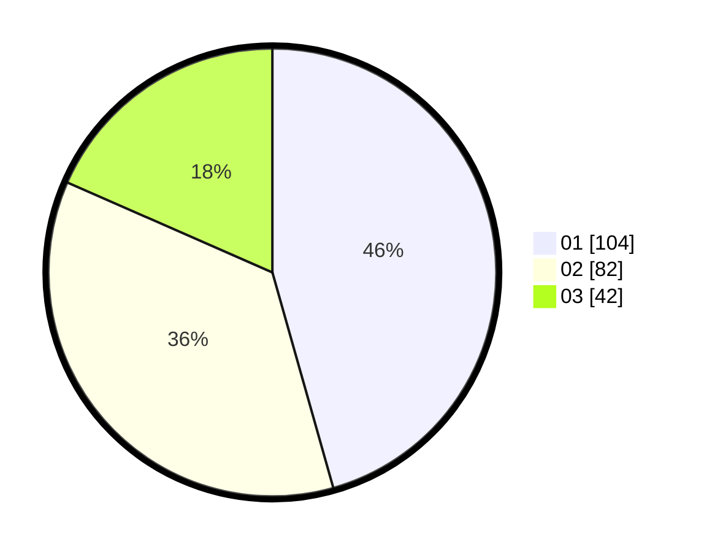

# Hasil

Hasil perolehan suara paslon dapat dilihat pada file paslon-01.txt, paslon-02.txt, dan paslon-03.txt.

Jika tidak ada, artinya data tersebut belum ada pada SIREKAP.

## Perolehan Suara

 * Paslon 01: **104**.
 * Paslon 02: **82**.
 * Paslon 03: **42**.

## Foto C Plano

https://sirekap-obj-formc.kpu.go.id/4a2c/pemilu/ppwp/31/74/05/10/02/3174051002141-20240214-155226--0ac766a7-bf6b-4036-a595-12558c700d9c.jpg

https://sirekap-obj-formc.kpu.go.id/4a2c/pemilu/ppwp/31/74/05/10/02/3174051002141-20240214-155242--e0b66e44-44f3-4087-9051-73202db46e0a.jpg

https://sirekap-obj-formc.kpu.go.id/4a2c/pemilu/ppwp/31/74/05/10/02/3174051002141-20240214-155257--96063a19-cdaf-473f-844e-8fa2a3ceb6af.jpg

## DATA PEMILIH TETAP

Jumlah pemilih dalam DPT: **266**.
 * L: **123**.
 * P: **143**.

## DATA PENGGUNA HAK PILIH

Jumlah pengguna hak pilih dalam DPT: **228**.
 * L: **107**.
 * P: **121**.

Jumlah pengguna hak pilih dalam DPTb: **6**.
 * L: **3**.
 * P: **3**.

Jumlah pengguna hak pilih dalam DPK: **0**.
 * L: **0**.
 * P: **0**.

Jumlah pengguna hak pilih: **234**.
 * L: **110**.
 * P: **124**.

## JUMLAH SUARA SAH DAN TIDAK SAH

JUMLAH SELURUH SUARA SAH: **228**.

JUMLAH SUARA TIDAK SAH: **6**.

JUMLAH SELURUH SUARA SAH DAN SUARA TIDAK SAH: **234**.
