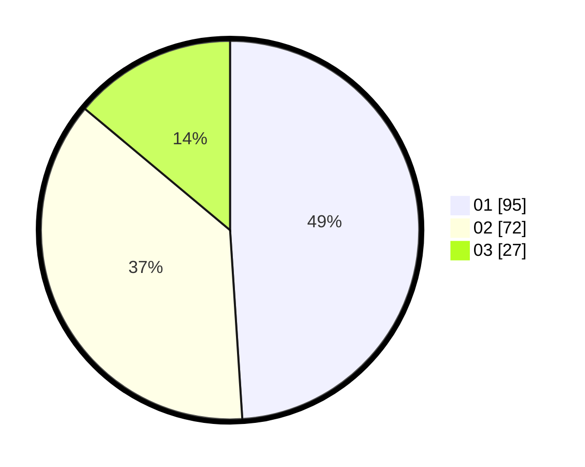

# Hasil

Hasil perolehan suara paslon dapat dilihat pada file paslon-01.txt, paslon-02.txt, dan paslon-03.txt.

Jika tidak ada, artinya data tersebut belum ada pada SIREKAP.

## Perolehan Suara

 * Paslon 01: **95**.
 * Paslon 02: **72**.
 * Paslon 03: **27**.

## Foto C Plano

https://sirekap-obj-formc.kpu.go.id/a720/pemilu/ppwp/31/74/05/10/02/3174051002151-20240214-200423--2cb05940-d86f-4262-819c-a1e2da91cee2.jpg

https://sirekap-obj-formc.kpu.go.id/a720/pemilu/ppwp/31/74/05/10/02/3174051002151-20240214-200559--0f0cd0ae-06bf-438b-abca-6509456eb961.jpg

https://sirekap-obj-formc.kpu.go.id/a720/pemilu/ppwp/31/74/05/10/02/3174051002151-20240214-200519--d791576c-9c76-4245-a8c6-c8c5af2d4e45.jpg

## DATA PEMILIH TETAP

Jumlah pemilih dalam DPT: **254**.
 * L: **118**.
 * P: **136**.

## DATA PENGGUNA HAK PILIH

Jumlah pengguna hak pilih dalam DPT: **187**.
 * L: **83**.
 * P: **104**.

Jumlah pengguna hak pilih dalam DPTb: **9**.
 * L: **5**.
 * P: **4**.

Jumlah pengguna hak pilih dalam DPK: **0**.
 * L: **0**.
 * P: **0**.

Jumlah pengguna hak pilih: **196**.
 * L: **88**.
 * P: **108**.

## JUMLAH SUARA SAH DAN TIDAK SAH

JUMLAH SELURUH SUARA SAH: **194**.

JUMLAH SUARA TIDAK SAH: **2**.

JUMLAH SELURUH SUARA SAH DAN SUARA TIDAK SAH: **196**.
