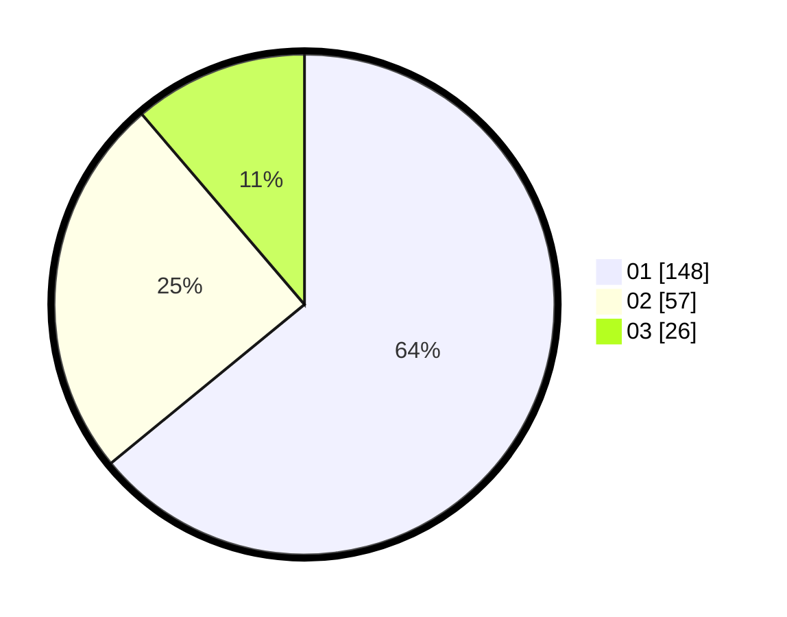

# Hasil

Hasil perolehan suara paslon dapat dilihat pada file paslon-01.txt, paslon-02.txt, dan paslon-03.txt.

Jika tidak ada, artinya data tersebut belum ada pada SIREKAP.

## Perolehan Suara

 * Paslon 01: **148**.
 * Paslon 02: **57**.
 * Paslon 03: **26**.

## Foto C Plano

https://sirekap-obj-formc.kpu.go.id/2b08/pemilu/ppwp/31/74/05/10/02/3174051002152-20240215-004924--f1913cbc-aefa-489d-bae6-1b46c4722d8e.jpg

https://sirekap-obj-formc.kpu.go.id/2b08/pemilu/ppwp/31/74/05/10/02/3174051002152-20240215-011232--065c7762-86c8-4823-bacb-6dc3a1d3612f.jpg

https://sirekap-obj-formc.kpu.go.id/2b08/pemilu/ppwp/31/74/05/10/02/3174051002152-20240215-005231--b90c5fc6-9f0c-4cee-8105-d180903dc1de.jpg
