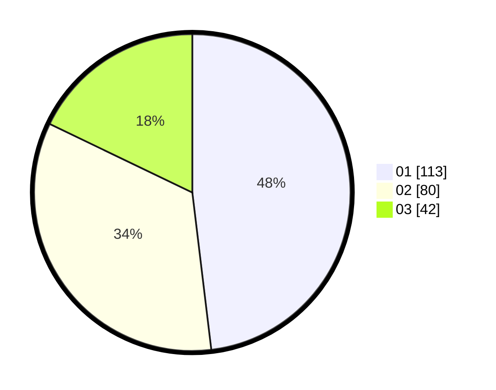

# Hasil

Hasil perolehan suara paslon dapat dilihat pada file paslon-01.txt, paslon-02.txt, dan paslon-03.txt.

Jika tidak ada, artinya data tersebut belum ada pada SIREKAP.

## Perolehan Suara

 * Paslon 01: **113**.
 * Paslon 02: **80**.
 * Paslon 03: **42**.

## Foto C Plano

https://sirekap-obj-formc.kpu.go.id/8a10/pemilu/ppwp/31/74/05/10/02/3174051002153-20240215-012734--307deb43-c9b7-4f9f-b8ed-addb70e6d9f1.jpg

https://sirekap-obj-formc.kpu.go.id/8a10/pemilu/ppwp/31/74/05/10/02/3174051002153-20240215-012815--9fd61ad8-7129-48fe-b307-00cebec7e853.jpg

https://sirekap-obj-formc.kpu.go.id/8a10/pemilu/ppwp/31/74/05/10/02/3174051002153-20240215-012855--502e8808-1c9e-43ff-93da-4ddac650af4f.jpg

## DATA PEMILIH TETAP

Jumlah pemilih dalam DPT: **277**.
 * L: **140**.
 * P: **137**.

## DATA PENGGUNA HAK PILIH

Jumlah pengguna hak pilih dalam DPT: **231**.
 * L: **112**.
 * P: **119**.

Jumlah pengguna hak pilih dalam DPTb: **5**.
 * L: **2**.
 * P: **3**.

Jumlah pengguna hak pilih dalam DPK: **1**.
 * L: **0**.
 * P: **1**.

Jumlah pengguna hak pilih: **237**.
 * L: **114**.
 * P: **123**.

## JUMLAH SUARA SAH DAN TIDAK SAH

JUMLAH SELURUH SUARA SAH: **235**.

JUMLAH SUARA TIDAK SAH: **2**.

JUMLAH SELURUH SUARA SAH DAN SUARA TIDAK SAH: **237**.
