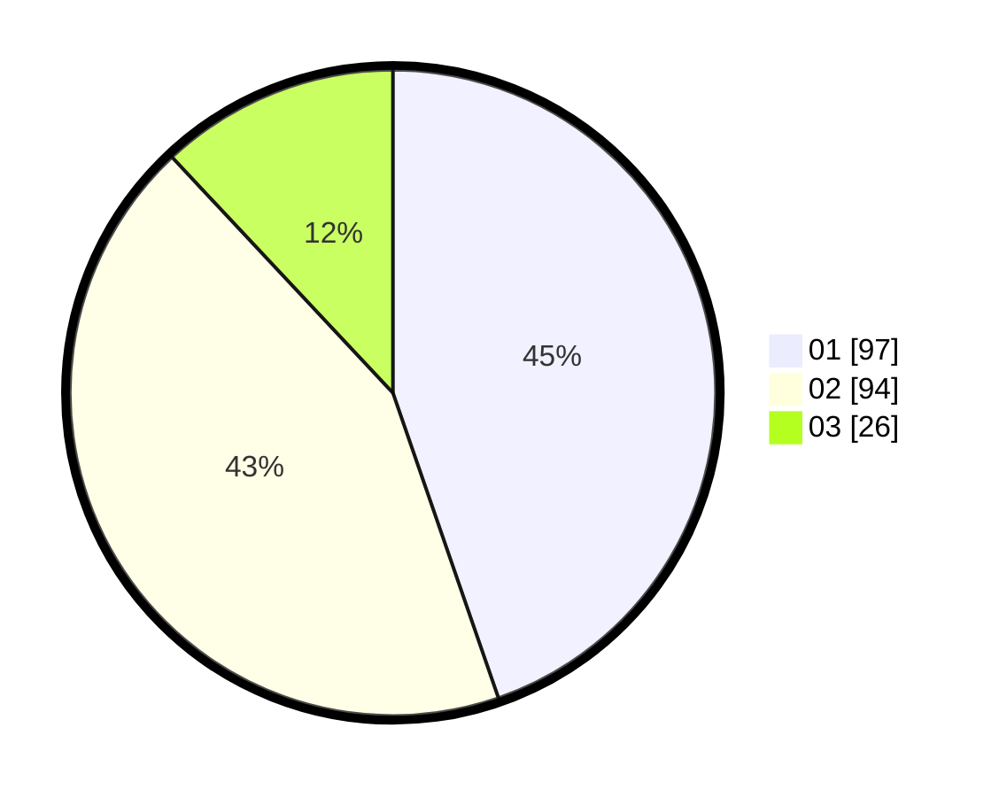

# Hasil

Hasil perolehan suara paslon dapat dilihat pada file paslon-01.txt, paslon-02.txt, dan paslon-03.txt.

Jika tidak ada, artinya data tersebut belum ada pada SIREKAP.

## Perolehan Suara

 * Paslon 01: **97**.
 * Paslon 02: **94**.
 * Paslon 03: **26**.

## Foto C Plano

https://sirekap-obj-formc.kpu.go.id/a8e9/pemilu/ppwp/31/74/05/10/02/3174051002155-20240214-184834--4e007fbb-ab5d-48d0-8f96-b3b2b33c1143.jpg

https://sirekap-obj-formc.kpu.go.id/a8e9/pemilu/ppwp/31/74/05/10/02/3174051002155-20240214-184852--9e9302a9-8796-48b3-826b-1e2f0f107124.jpg

https://sirekap-obj-formc.kpu.go.id/a8e9/pemilu/ppwp/31/74/05/10/02/3174051002155-20240214-233339--15faf8c5-8847-4d73-af26-7cd563163efc.jpg

## DATA PEMILIH TETAP

Jumlah pemilih dalam DPT: **255**.
 * L: **126**.
 * P: **129**.

## DATA PENGGUNA HAK PILIH

Jumlah pengguna hak pilih dalam DPT: **215**.
 * L: **97**.
 * P: **118**.

Jumlah pengguna hak pilih dalam DPTb: **2**.
 * L: **2**.
 * P: **0**.

Jumlah pengguna hak pilih dalam DPK: **3**.
 * L: **3**.
 * P: **0**.

Jumlah pengguna hak pilih: **220**.
 * L: **102**.
 * P: **118**.

## JUMLAH SUARA SAH DAN TIDAK SAH

JUMLAH SELURUH SUARA SAH: **217**.

JUMLAH SUARA TIDAK SAH: **3**.

JUMLAH SELURUH SUARA SAH DAN SUARA TIDAK SAH: **220**.
