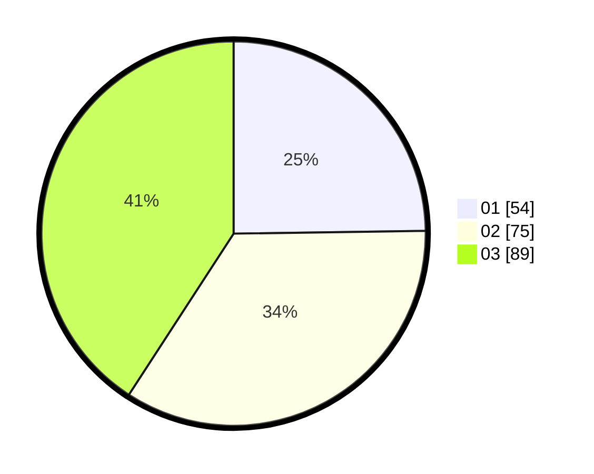

# Hasil

Hasil perolehan suara paslon dapat dilihat pada file paslon-01.txt, paslon-02.txt, dan paslon-03.txt.

Jika tidak ada, artinya data tersebut belum ada pada SIREKAP.

## Perolehan Suara

 * Paslon 01: **54**.
 * Paslon 02: **75**.
 * Paslon 03: **89**.

## Foto C Plano

https://sirekap-obj-formc.kpu.go.id/fd27/pemilu/ppwp/31/74/05/10/02/3174051002166-20240218-215842--0e56b307-bd0a-44e1-80cc-1ac98b4cdf44.jpg

https://sirekap-obj-formc.kpu.go.id/fd27/pemilu/ppwp/31/74/05/10/02/3174051002166-20240214-160108--351212c7-45f5-41df-9445-1ce63f71689d.jpg

https://sirekap-obj-formc.kpu.go.id/fd27/pemilu/ppwp/31/74/05/10/02/3174051002166-20240214-210458--00551246-f3c4-432b-9503-14f111ac01cf.jpg

## DATA PEMILIH TETAP

Jumlah pemilih dalam DPT: **256**.
 * L: **121**.
 * P: **135**.

## DATA PENGGUNA HAK PILIH

Jumlah pengguna hak pilih dalam DPT: **190**.
 * L: **85**.
 * P: **105**.

Jumlah pengguna hak pilih dalam DPTb: **28**.
 * L: **11**.
 * P: **17**.

Jumlah pengguna hak pilih dalam DPK: **6**.
 * L: **3**.
 * P: **3**.

Jumlah pengguna hak pilih: **224**.
 * L: **99**.
 * P: **125**.

## JUMLAH SUARA SAH DAN TIDAK SAH

JUMLAH SELURUH SUARA SAH: **218**.

JUMLAH SUARA TIDAK SAH: **6**.

JUMLAH SELURUH SUARA SAH DAN SUARA TIDAK SAH: **224**.
