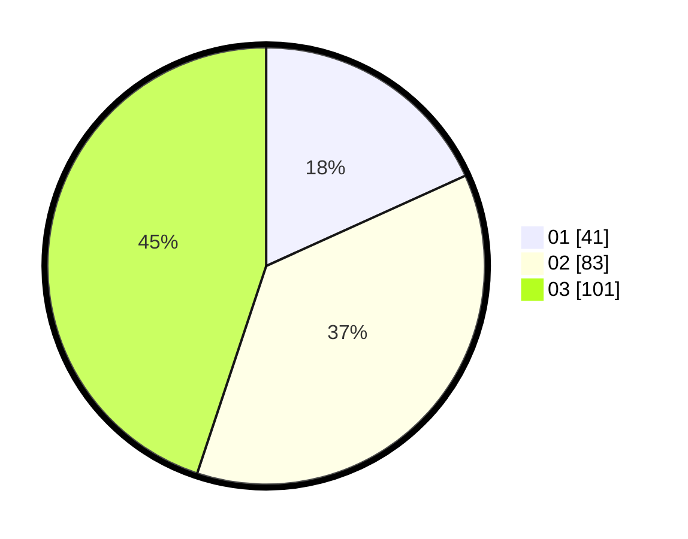

# Hasil

Hasil perolehan suara paslon dapat dilihat pada file paslon-01.txt, paslon-02.txt, dan paslon-03.txt.

Jika tidak ada, artinya data tersebut belum ada pada SIREKAP.

## Perolehan Suara

 * Paslon 01: **41**.
 * Paslon 02: **83**.
 * Paslon 03: **101**.

## Foto C Plano

https://sirekap-obj-formc.kpu.go.id/3f8f/pemilu/ppwp/31/74/05/10/02/3174051002167-20240217-105643--1bb10691-9f50-4874-b30a-a707398bcb05.jpg

https://sirekap-obj-formc.kpu.go.id/3f8f/pemilu/ppwp/31/74/05/10/02/3174051002167-20240217-124403--a9f7e045-8d02-4a80-9a65-4facbdf662d2.jpg

https://sirekap-obj-formc.kpu.go.id/3f8f/pemilu/ppwp/31/74/05/10/02/3174051002167-20240217-105417--e023f800-f344-445b-9b8b-3f6a2009c4ec.jpg

## DATA PEMILIH TETAP

Jumlah pemilih dalam DPT: **262**.
 * L: **118**.
 * P: **144**.

## DATA PENGGUNA HAK PILIH

Jumlah pengguna hak pilih dalam DPT: **197**.
 * L: **95**.
 * P: **102**.

Jumlah pengguna hak pilih dalam DPTb: **26**.
 * L: **17**.
 * P: **9**.

Jumlah pengguna hak pilih dalam DPK: **5**.
 * L: **0**.
 * P: **5**.

Jumlah pengguna hak pilih: **228**.
 * L: **112**.
 * P: **116**.

## JUMLAH SUARA SAH DAN TIDAK SAH

JUMLAH SELURUH SUARA SAH: **225**.

JUMLAH SUARA TIDAK SAH: **3**.

JUMLAH SELURUH SUARA SAH DAN SUARA TIDAK SAH: **228**.
