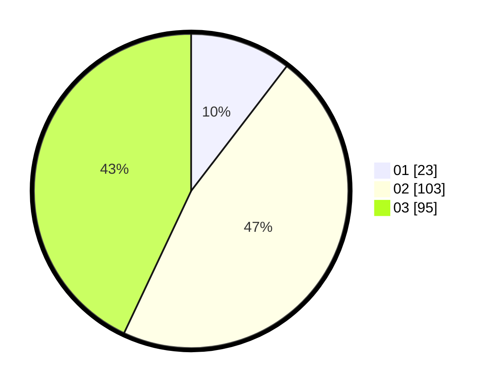

# Hasil

Hasil perolehan suara paslon dapat dilihat pada file paslon-01.txt, paslon-02.txt, dan paslon-03.txt.

Jika tidak ada, artinya data tersebut belum ada pada SIREKAP.

## Perolehan Suara

 * Paslon 01: **23**.
 * Paslon 02: **103**.
 * Paslon 03: **95**.

## Foto C Plano

https://sirekap-obj-formc.kpu.go.id/e4cc/pemilu/ppwp/31/74/05/10/02/3174051002169-20240214-192111--0b5c0fdc-18ee-4edd-af5a-4ade3c4160e1.jpg

https://sirekap-obj-formc.kpu.go.id/e4cc/pemilu/ppwp/31/74/05/10/02/3174051002169-20240214-192117--aa12692a-f3c1-4da4-9e28-d813f1253e82.jpg

https://sirekap-obj-formc.kpu.go.id/e4cc/pemilu/ppwp/31/74/05/10/02/3174051002169-20240214-192121--b4970bc4-df57-4b6b-a562-3d07f4c15540.jpg

## DATA PEMILIH TETAP

Jumlah pemilih dalam DPT: **280**.
 * L: **137**.
 * P: **143**.

## DATA PENGGUNA HAK PILIH

Jumlah pengguna hak pilih dalam DPT: **202**.
 * L: **100**.
 * P: **102**.

Jumlah pengguna hak pilih dalam DPTb: **20**.
 * L: **7**.
 * P: **13**.

Jumlah pengguna hak pilih dalam DPK: **1**.
 * L: **1**.
 * P: **0**.

Jumlah pengguna hak pilih: **223**.
 * L: **108**.
 * P: **115**.

## JUMLAH SUARA SAH DAN TIDAK SAH

JUMLAH SELURUH SUARA SAH: **221**.

JUMLAH SUARA TIDAK SAH: **2**.

JUMLAH SELURUH SUARA SAH DAN SUARA TIDAK SAH: **223**.
