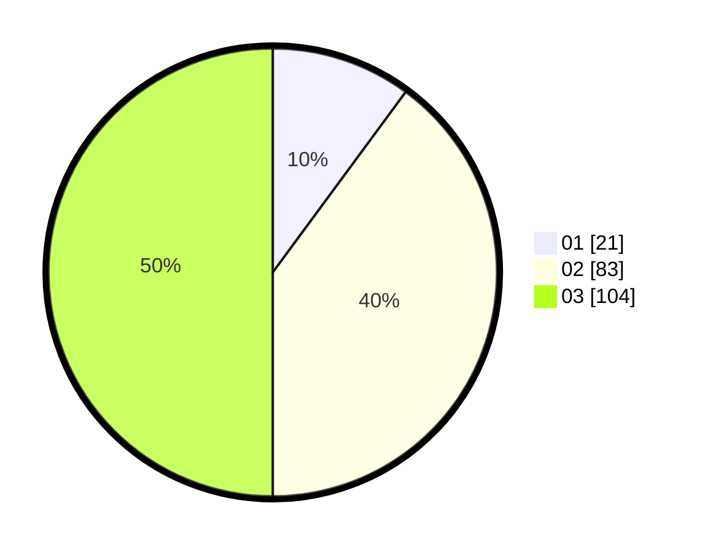

# Hasil

Hasil perolehan suara paslon dapat dilihat pada file paslon-01.txt, paslon-02.txt, dan paslon-03.txt.

Jika tidak ada, artinya data tersebut belum ada pada SIREKAP.

## Perolehan Suara

 * Paslon 01: **21**.
 * Paslon 02: **83**.
 * Paslon 03: **104**.

## Foto C Plano

https://sirekap-obj-formc.kpu.go.id/7c7d/pemilu/ppwp/31/74/05/10/02/3174051002171-20240214-224137--2fa63b49-3cd9-4955-8112-c8223ed7d0f7.jpg

https://sirekap-obj-formc.kpu.go.id/7c7d/pemilu/ppwp/31/74/05/10/02/3174051002171-20240217-163008--4e4283ac-9dec-41c1-8c53-9b15972a4fc1.jpg

https://sirekap-obj-formc.kpu.go.id/7c7d/pemilu/ppwp/31/74/05/10/02/3174051002171-20240217-163441--48a87eee-1ac9-47fb-9b1e-9789bb65e289.jpg

## DATA PEMILIH TETAP

Jumlah pemilih dalam DPT: **285**.
 * L: **140**.
 * P: **145**.

## DATA PENGGUNA HAK PILIH

Jumlah pengguna hak pilih dalam DPT: **188**.
 * L: **90**.
 * P: **98**.

Jumlah pengguna hak pilih dalam DPTb: **18**.
 * L: **5**.
 * P: **13**.

Jumlah pengguna hak pilih dalam DPK: **5**.
 * L: **2**.
 * P: **3**.

Jumlah pengguna hak pilih: **211**.
 * L: **97**.
 * P: **114**.

## JUMLAH SUARA SAH DAN TIDAK SAH

JUMLAH SELURUH SUARA SAH: **208**.

JUMLAH SUARA TIDAK SAH: **3**.

JUMLAH SELURUH SUARA SAH DAN SUARA TIDAK SAH: **211**.
