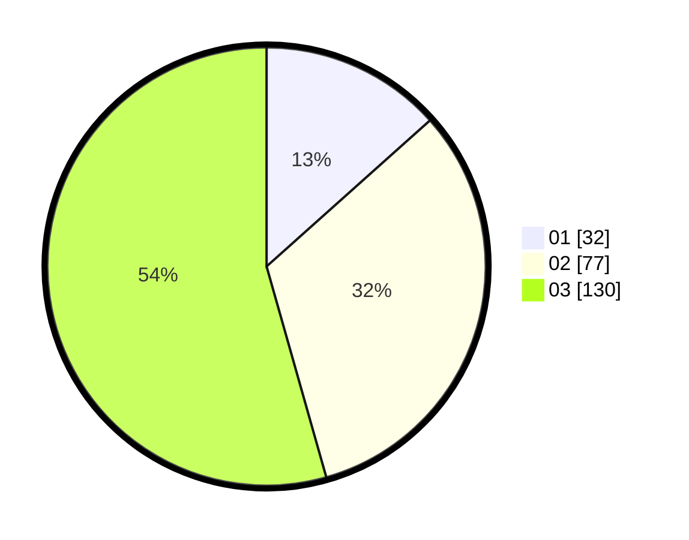

# Hasil

Hasil perolehan suara paslon dapat dilihat pada file paslon-01.txt, paslon-02.txt, dan paslon-03.txt.

Jika tidak ada, artinya data tersebut belum ada pada SIREKAP.

## Perolehan Suara

 * Paslon 01: **32**.
 * Paslon 02: **77**.
 * Paslon 03: **130**.

## Foto C Plano

https://sirekap-obj-formc.kpu.go.id/8f7b/pemilu/ppwp/31/74/05/10/02/3174051002174-20240214-200015--d5aa608e-6ed7-4177-ad3e-58089583d297.jpg

https://sirekap-obj-formc.kpu.go.id/8f7b/pemilu/ppwp/31/74/05/10/02/3174051002174-20240214-200135--78663b2f-39f1-4e27-b1cf-9adb11ef7c09.jpg

https://sirekap-obj-formc.kpu.go.id/8f7b/pemilu/ppwp/31/74/05/10/02/3174051002174-20240214-212145--a18e9115-15ef-4662-8f23-851cb2bb1365.jpg

## DATA PEMILIH TETAP

Jumlah pemilih dalam DPT: **289**.
 * L: **132**.
 * P: **157**.

## DATA PENGGUNA HAK PILIH

Jumlah pengguna hak pilih dalam DPT: **212**.
 * L: **99**.
 * P: **113**.

Jumlah pengguna hak pilih dalam DPTb: **29**.
 * L: **12**.
 * P: **17**.

Jumlah pengguna hak pilih dalam DPK: **5**.
 * L: **1**.
 * P: **4**.

Jumlah pengguna hak pilih: **246**.
 * L: **112**.
 * P: **134**.

## JUMLAH SUARA SAH DAN TIDAK SAH

JUMLAH SELURUH SUARA SAH: **239**.

JUMLAH SUARA TIDAK SAH: **7**.

JUMLAH SELURUH SUARA SAH DAN SUARA TIDAK SAH: **246**.
