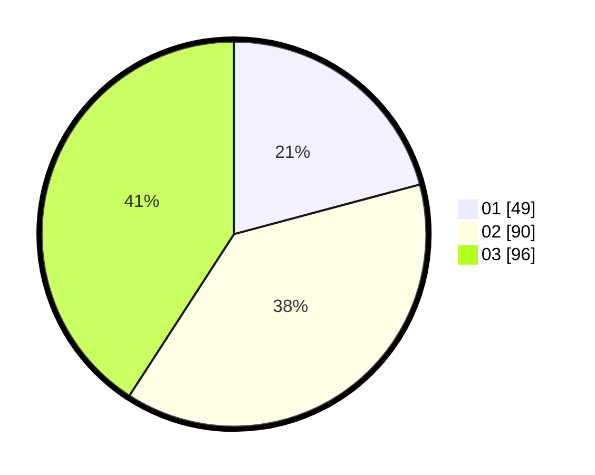

# Hasil

Hasil perolehan suara paslon dapat dilihat pada file paslon-01.txt, paslon-02.txt, dan paslon-03.txt.

Jika tidak ada, artinya data tersebut belum ada pada SIREKAP.

## Perolehan Suara

 * Paslon 01: **49**.
 * Paslon 02: **90**.
 * Paslon 03: **96**.

## Foto C Plano

https://sirekap-obj-formc.kpu.go.id/b3cf/pemilu/ppwp/31/74/05/10/02/3174051002178-20240214-221553--f2fb7be5-d6c3-4a88-aab6-e4818af7beb6.jpg

https://sirekap-obj-formc.kpu.go.id/b3cf/pemilu/ppwp/31/74/05/10/02/3174051002178-20240214-221606--a09ae9ef-08bf-47a6-945b-5fbc81f573e3.jpg

https://sirekap-obj-formc.kpu.go.id/b3cf/pemilu/ppwp/31/74/05/10/02/3174051002178-20240214-221620--d918525b-cb8b-4ac7-97a5-667bea4b23ef.jpg

## DATA PEMILIH TETAP

Jumlah pemilih dalam DPT: **297**.
 * L: **144**.
 * P: **153**.

## DATA PENGGUNA HAK PILIH

Jumlah pengguna hak pilih dalam DPT: **216**.
 * L: **102**.
 * P: **114**.

Jumlah pengguna hak pilih dalam DPTb: **18**.
 * L: **3**.
 * P: **13**.

Jumlah pengguna hak pilih dalam DPK: **3**.
 * L: **0**.
 * P: **3**.

Jumlah pengguna hak pilih: **237**.
 * L: **107**.
 * P: **130**.

## JUMLAH SUARA SAH DAN TIDAK SAH

JUMLAH SELURUH SUARA SAH: **235**.

JUMLAH SUARA TIDAK SAH: **2**.

JUMLAH SELURUH SUARA SAH DAN SUARA TIDAK SAH: **237**.
