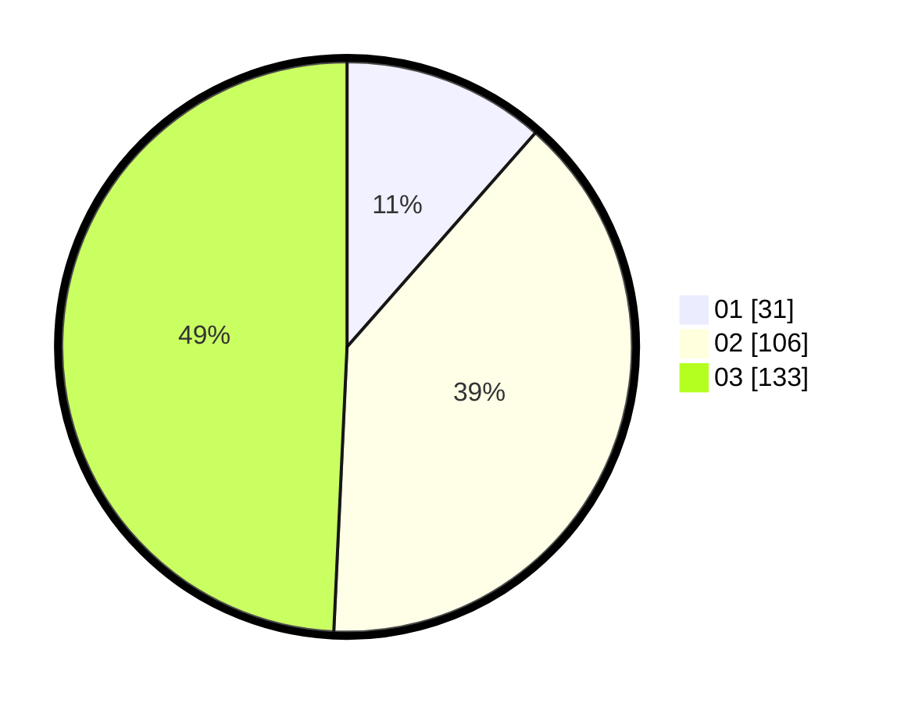

# Hasil

Hasil perolehan suara paslon dapat dilihat pada file paslon-01.txt, paslon-02.txt, dan paslon-03.txt.

Jika tidak ada, artinya data tersebut belum ada pada SIREKAP.

## Perolehan Suara

 * Paslon 01: **31**.
 * Paslon 02: **106**.
 * Paslon 03: **133**.

## Foto C Plano

https://sirekap-obj-formc.kpu.go.id/a40f/pemilu/ppwp/31/74/05/10/02/3174051002179-20240216-163857--0f3cbfb5-e3a1-4535-8ee3-c00ea1d09a97.jpg

https://sirekap-obj-formc.kpu.go.id/a40f/pemilu/ppwp/31/74/05/10/02/3174051002179-20240216-172011--e6e48dcd-112c-4d7c-a515-403c7efbbbc6.jpg

https://sirekap-obj-formc.kpu.go.id/a40f/pemilu/ppwp/31/74/05/10/02/3174051002179-20240216-161119--e6f33a1f-9502-449c-8a42-09633cd7a8a2.jpg

## DATA PEMILIH TETAP

Jumlah pemilih dalam DPT: **292**.
 * L: **131**.
 * P: **161**.

## DATA PENGGUNA HAK PILIH

Jumlah pengguna hak pilih dalam DPT: **240**.
 * L: **107**.
 * P: **133**.

Jumlah pengguna hak pilih dalam DPTb: **28**.
 * L: **12**.
 * P: **16**.

Jumlah pengguna hak pilih dalam DPK: **6**.
 * L: **3**.
 * P: **3**.

Jumlah pengguna hak pilih: **274**.
 * L: **122**.
 * P: **152**.

## JUMLAH SUARA SAH DAN TIDAK SAH

JUMLAH SELURUH SUARA SAH: **270**.

JUMLAH SUARA TIDAK SAH: **4**.

JUMLAH SELURUH SUARA SAH DAN SUARA TIDAK SAH: **274**.
