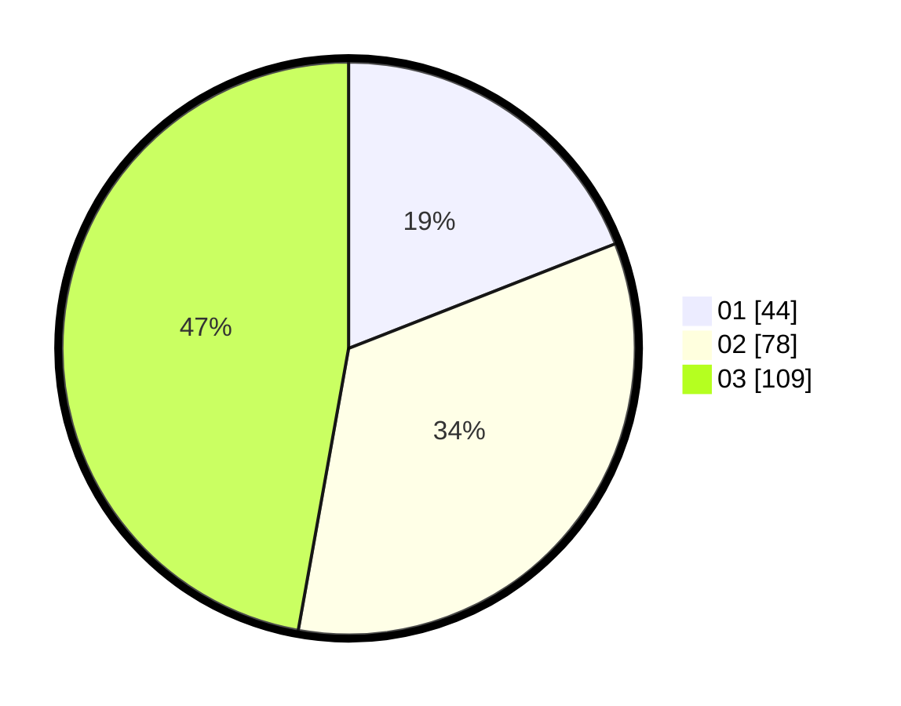

# Hasil

Hasil perolehan suara paslon dapat dilihat pada file paslon-01.txt, paslon-02.txt, dan paslon-03.txt.

Jika tidak ada, artinya data tersebut belum ada pada SIREKAP.

## Perolehan Suara

 * Paslon 01: **44**.
 * Paslon 02: **78**.
 * Paslon 03: **109**.

## Foto C Plano

https://sirekap-obj-formc.kpu.go.id/3ed6/pemilu/ppwp/31/74/05/10/02/3174051002190-20240214-155056--4a9bf4ab-b3ee-4b4a-a909-a833a9ab27a6.jpg

https://sirekap-obj-formc.kpu.go.id/3ed6/pemilu/ppwp/31/74/05/10/02/3174051002190-20240214-155248--14ce4c5d-8bca-44a1-bd8a-ad5bff928e63.jpg

https://sirekap-obj-formc.kpu.go.id/3ed6/pemilu/ppwp/31/74/05/10/02/3174051002190-20240214-155332--b5786cac-4687-4dc8-9bbc-a11903ed9d84.jpg

## DATA PEMILIH TETAP

Jumlah pemilih dalam DPT: **261**.
 * L: **117**.
 * P: **144**.

## DATA PENGGUNA HAK PILIH

Jumlah pengguna hak pilih dalam DPT: **210**.
 * L: **94**.
 * P: **116**.

Jumlah pengguna hak pilih dalam DPTb: **17**.
 * L: **3**.
 * P: **14**.

Jumlah pengguna hak pilih dalam DPK: **4**.
 * L: **3**.
 * P: **1**.

Jumlah pengguna hak pilih: **231**.
 * L: **100**.
 * P: **131**.

## JUMLAH SUARA SAH DAN TIDAK SAH

JUMLAH SELURUH SUARA SAH: **231**.

JUMLAH SUARA TIDAK SAH: **0**.

JUMLAH SELURUH SUARA SAH DAN SUARA TIDAK SAH: **231**.
