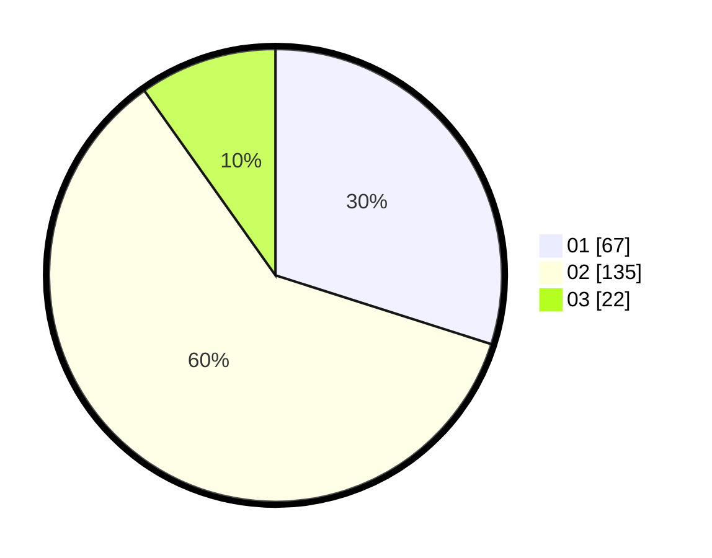

# Hasil

Hasil perolehan suara paslon dapat dilihat pada file paslon-01.txt, paslon-02.txt, dan paslon-03.txt.

Jika tidak ada, artinya data tersebut belum ada pada SIREKAP.

## Perolehan Suara

 * Paslon 01: **67**.
 * Paslon 02: **135**.
 * Paslon 03: **22**.

## Foto C Plano

https://sirekap-obj-formc.kpu.go.id/b31f/pemilu/ppwp/31/74/05/10/03/3174051003005-20240214-211402--039db793-f900-424d-8ead-ea6d7eaa3bae.jpg

https://sirekap-obj-formc.kpu.go.id/b31f/pemilu/ppwp/31/74/05/10/03/3174051003005-20240214-193413--cacd6842-c4c1-4d37-abf5-ab40ee10faa4.jpg

https://sirekap-obj-formc.kpu.go.id/b31f/pemilu/ppwp/31/74/05/10/03/3174051003005-20240214-194033--14a97914-37f5-452b-a5aa-36915bba3c21.jpg

## DATA PEMILIH TETAP

Jumlah pemilih dalam DPT: **265**.
 * L: **132**.
 * P: **133**.

## DATA PENGGUNA HAK PILIH

Jumlah pengguna hak pilih dalam DPT: **222**.
 * L: **106**.
 * P: **116**.

Jumlah pengguna hak pilih dalam DPTb: **1**.
 * L: **0**.
 * P: **1**.

Jumlah pengguna hak pilih dalam DPK: **1**.
 * L: **1**.
 * P: **0**.

Jumlah pengguna hak pilih: **224**.
 * L: **107**.
 * P: **117**.

## JUMLAH SUARA SAH DAN TIDAK SAH

JUMLAH SELURUH SUARA SAH: **224**.

JUMLAH SUARA TIDAK SAH: **0**.

JUMLAH SELURUH SUARA SAH DAN SUARA TIDAK SAH: **224**.
