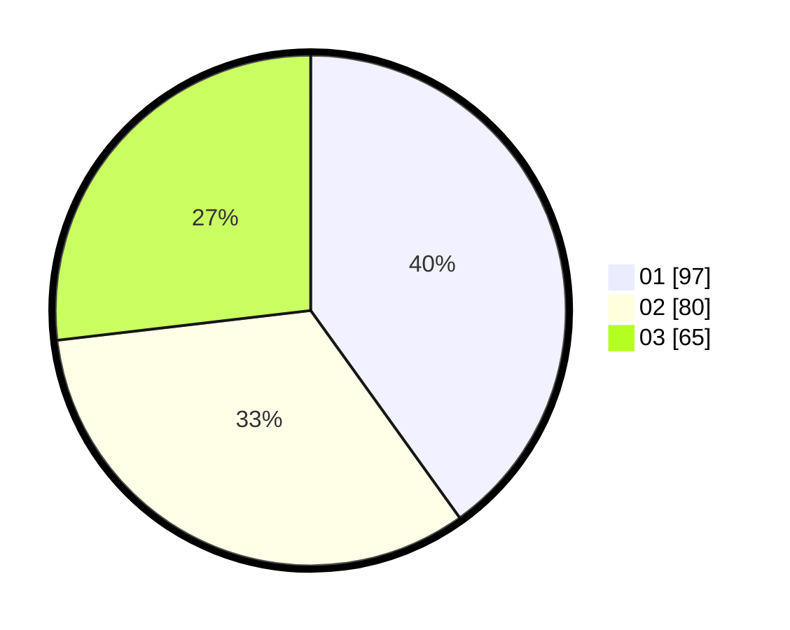

# Hasil

Hasil perolehan suara paslon dapat dilihat pada file paslon-01.txt, paslon-02.txt, dan paslon-03.txt.

Jika tidak ada, artinya data tersebut belum ada pada SIREKAP.

## Perolehan Suara

 * Paslon 01: **97**.
 * Paslon 02: **80**.
 * Paslon 03: **65**.

## Foto C Plano

https://sirekap-obj-formc.kpu.go.id/d2e6/pemilu/ppwp/31/74/05/10/03/3174051003007-20240214-200118--3854698d-f3ab-42ee-a88e-c95da13cf04e.jpg

https://sirekap-obj-formc.kpu.go.id/d2e6/pemilu/ppwp/31/74/05/10/03/3174051003007-20240214-200251--132ce472-c70a-4caf-85b0-9ddccfa6d89b.jpg

https://sirekap-obj-formc.kpu.go.id/d2e6/pemilu/ppwp/31/74/05/10/03/3174051003007-20240214-200303--4f64169e-e11a-45d3-8856-dbee07989c81.jpg

## DATA PEMILIH TETAP

Jumlah pemilih dalam DPT: **271**.
 * L: **125**.
 * P: **146**.

## DATA PENGGUNA HAK PILIH

Jumlah pengguna hak pilih dalam DPT: **243**.
 * L: **130**.
 * P: **113**.

Jumlah pengguna hak pilih dalam DPTb: **0**.
 * L: **0**.
 * P: **0**.

Jumlah pengguna hak pilih dalam DPK: **0**.
 * L: **0**.
 * P: **0**.

Jumlah pengguna hak pilih: **243**.
 * L: **130**.
 * P: **113**.

## JUMLAH SUARA SAH DAN TIDAK SAH

JUMLAH SELURUH SUARA SAH: **242**.

JUMLAH SUARA TIDAK SAH: **1**.

JUMLAH SELURUH SUARA SAH DAN SUARA TIDAK SAH: **243**.
