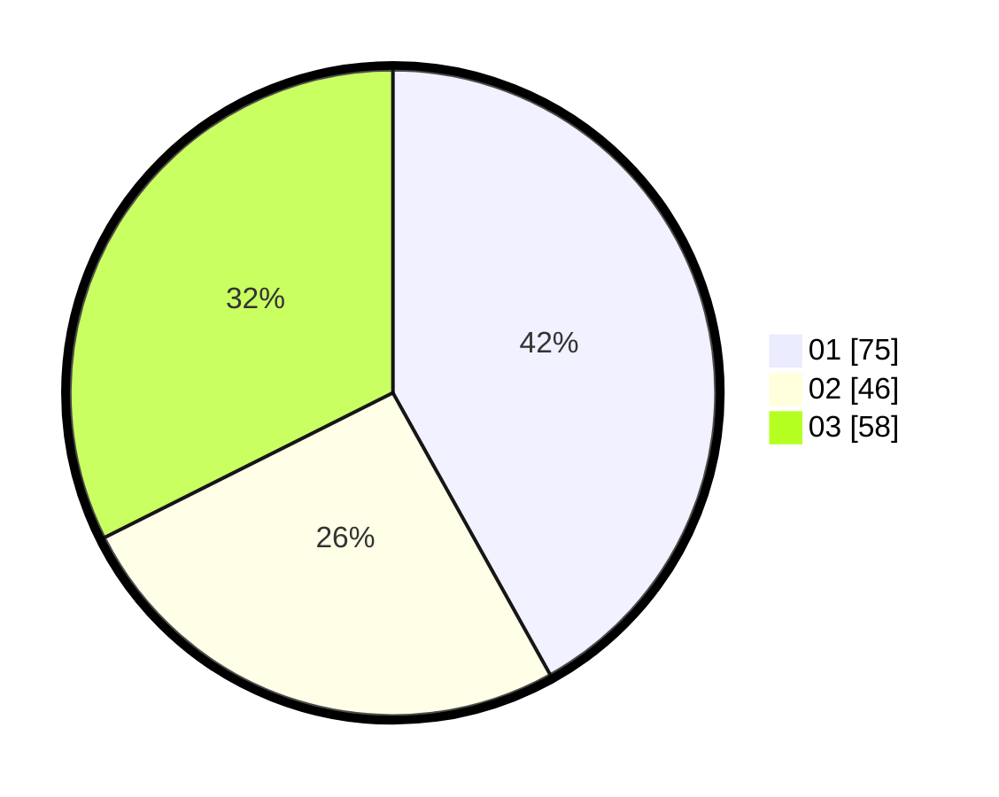

# Hasil

Hasil perolehan suara paslon dapat dilihat pada file paslon-01.txt, paslon-02.txt, dan paslon-03.txt.

Jika tidak ada, artinya data tersebut belum ada pada SIREKAP.

## Perolehan Suara

 * Paslon 01: **75**.
 * Paslon 02: **46**.
 * Paslon 03: **58**.

## Foto C Plano

https://sirekap-obj-formc.kpu.go.id/4610/pemilu/ppwp/31/74/05/10/03/3174051003011-20240218-145857--190ccfa0-6e51-4cf6-9937-497c0d01464e.jpg

https://sirekap-obj-formc.kpu.go.id/4610/pemilu/ppwp/31/74/05/10/03/3174051003011-20240214-190726--6fca524b-6b2e-41c7-a0a8-c780ffe9428c.jpg

https://sirekap-obj-formc.kpu.go.id/4610/pemilu/ppwp/31/74/05/10/03/3174051003011-20240218-150025--5d11b39f-388f-44cf-91e0-4ecc274520a2.jpg

## DATA PEMILIH TETAP

Jumlah pemilih dalam DPT: **245**.
 * L: **105**.
 * P: **140**.

## DATA PENGGUNA HAK PILIH

Jumlah pengguna hak pilih dalam DPT: **183**.
 * L: **78**.
 * P: **105**.

Jumlah pengguna hak pilih dalam DPTb: **0**.
 * L: **0**.
 * P: **0**.

Jumlah pengguna hak pilih dalam DPK: **0**.
 * L: **0**.
 * P: **0**.

Jumlah pengguna hak pilih: **183**.
 * L: **78**.
 * P: **105**.

## JUMLAH SUARA SAH DAN TIDAK SAH

JUMLAH SELURUH SUARA SAH: **179**.

JUMLAH SUARA TIDAK SAH: **4**.

JUMLAH SELURUH SUARA SAH DAN SUARA TIDAK SAH: **183**.
