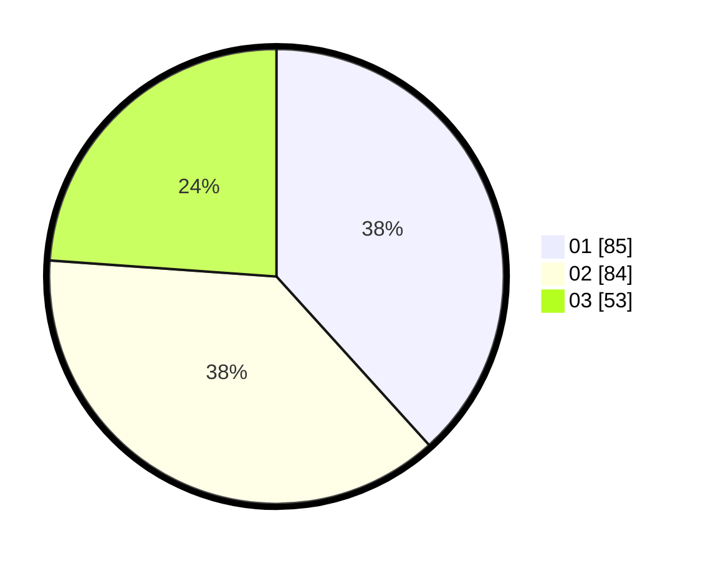

# Hasil

Hasil perolehan suara paslon dapat dilihat pada file paslon-01.txt, paslon-02.txt, dan paslon-03.txt.

Jika tidak ada, artinya data tersebut belum ada pada SIREKAP.

## Perolehan Suara

 * Paslon 01: **85**.
 * Paslon 02: **84**.
 * Paslon 03: **53**.

## Foto C Plano

https://sirekap-obj-formc.kpu.go.id/7287/pemilu/ppwp/31/74/05/10/03/3174051003017-20240219-021847--f41e0432-cd34-4a4d-a62f-b95eb2137dfa.jpg

https://sirekap-obj-formc.kpu.go.id/7287/pemilu/ppwp/31/74/05/10/03/3174051003017-20240219-014905--2d9e54b9-2b2c-4cb8-8df2-2d1f5bb21688.jpg

https://sirekap-obj-formc.kpu.go.id/7287/pemilu/ppwp/31/74/05/10/03/3174051003017-20240219-013135--cc606880-f242-46b8-8b8c-c386a63f1593.jpg

## DATA PEMILIH TETAP

Jumlah pemilih dalam DPT: **275**.
 * L: **132**.
 * P: **143**.

## DATA PENGGUNA HAK PILIH

Jumlah pengguna hak pilih dalam DPT: **213**.
 * L: **95**.
 * P: **118**.

Jumlah pengguna hak pilih dalam DPTb: **0**.
 * L: **0**.
 * P: **0**.

Jumlah pengguna hak pilih dalam DPK: **12**.
 * L: **8**.
 * P: **4**.

Jumlah pengguna hak pilih: **225**.
 * L: **103**.
 * P: **122**.

## JUMLAH SUARA SAH DAN TIDAK SAH

JUMLAH SELURUH SUARA SAH: **222**.

JUMLAH SUARA TIDAK SAH: **3**.

JUMLAH SELURUH SUARA SAH DAN SUARA TIDAK SAH: **225**.
