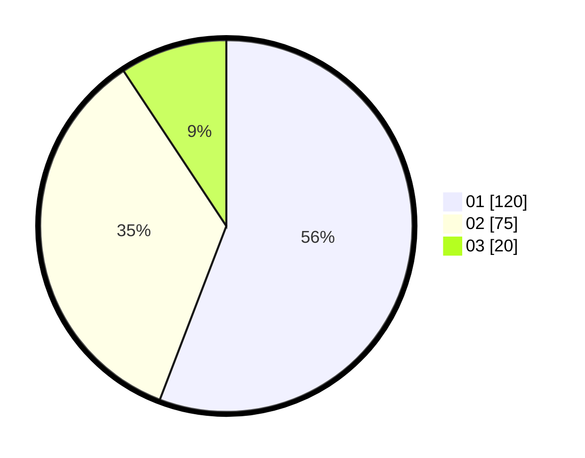

# Hasil

Hasil perolehan suara paslon dapat dilihat pada file paslon-01.txt, paslon-02.txt, dan paslon-03.txt.

Jika tidak ada, artinya data tersebut belum ada pada SIREKAP.

## Perolehan Suara

 * Paslon 01: **120**.
 * Paslon 02: **75**.
 * Paslon 03: **20**.

## Foto C Plano

https://sirekap-obj-formc.kpu.go.id/4437/pemilu/ppwp/31/74/05/10/03/3174051003018-20240218-161356--e43cf17b-1d4e-4c3e-ba32-4797d48c4cec.jpg

https://sirekap-obj-formc.kpu.go.id/4437/pemilu/ppwp/31/74/05/10/03/3174051003018-20240218-161449--14584379-4410-4988-aec6-d8ef160e895f.jpg

https://sirekap-obj-formc.kpu.go.id/4437/pemilu/ppwp/31/74/05/10/03/3174051003018-20240218-161523--517d0dfd-3870-4ca8-9f6e-d65d1d877dcb.jpg

## DATA PEMILIH TETAP

Jumlah pemilih dalam DPT: **283**.
 * L: **138**.
 * P: **145**.

## DATA PENGGUNA HAK PILIH

Jumlah pengguna hak pilih dalam DPT: **216**.
 * L: **103**.
 * P: **113**.

Jumlah pengguna hak pilih dalam DPTb: **0**.
 * L: **0**.
 * P: **0**.

Jumlah pengguna hak pilih dalam DPK: **1**.
 * L: **0**.
 * P: **1**.

Jumlah pengguna hak pilih: **217**.
 * L: **103**.
 * P: **114**.

## JUMLAH SUARA SAH DAN TIDAK SAH

JUMLAH SELURUH SUARA SAH: **215**.

JUMLAH SUARA TIDAK SAH: **2**.

JUMLAH SELURUH SUARA SAH DAN SUARA TIDAK SAH: **217**.
