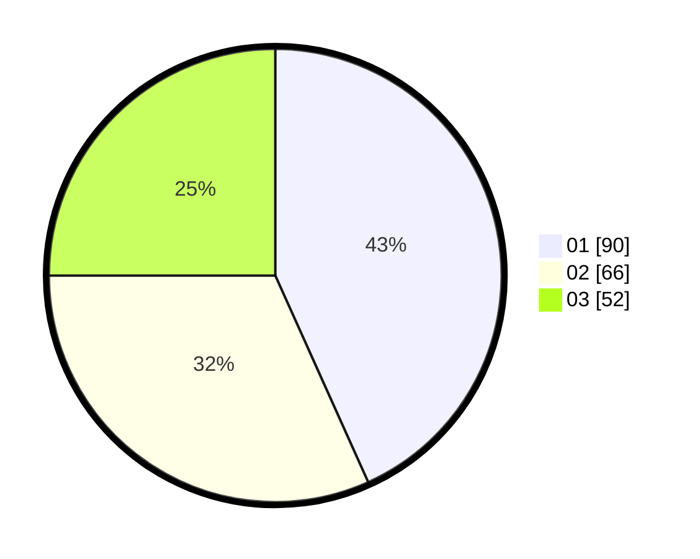

# Hasil

Hasil perolehan suara paslon dapat dilihat pada file paslon-01.txt, paslon-02.txt, dan paslon-03.txt.

Jika tidak ada, artinya data tersebut belum ada pada SIREKAP.

## Perolehan Suara

 * Paslon 01: **90**.
 * Paslon 02: **66**.
 * Paslon 03: **52**.

## Foto C Plano

https://sirekap-obj-formc.kpu.go.id/923d/pemilu/ppwp/31/74/05/10/03/3174051003019-20240218-203650--da10a98d-4b07-42fd-90b3-0eb9a3a932ad.jpg

https://sirekap-obj-formc.kpu.go.id/923d/pemilu/ppwp/31/74/05/10/03/3174051003019-20240218-204946--03695fd0-8e84-4ead-b15c-fc26d63886b1.jpg

https://sirekap-obj-formc.kpu.go.id/923d/pemilu/ppwp/31/74/05/10/03/3174051003019-20240218-195457--684f9c01-6c53-4830-954f-edc72886d387.jpg

## DATA PEMILIH TETAP

Jumlah pemilih dalam DPT: **274**.
 * L: **124**.
 * P: **150**.

## DATA PENGGUNA HAK PILIH

Jumlah pengguna hak pilih dalam DPT: **208**.
 * L: **92**.
 * P: **116**.

Jumlah pengguna hak pilih dalam DPTb: **0**.
 * L: **0**.
 * P: **0**.

Jumlah pengguna hak pilih dalam DPK: **1**.
 * L: **0**.
 * P: **1**.

Jumlah pengguna hak pilih: **209**.
 * L: **92**.
 * P: **117**.

## JUMLAH SUARA SAH DAN TIDAK SAH

JUMLAH SELURUH SUARA SAH: **208**.

JUMLAH SUARA TIDAK SAH: **1**.

JUMLAH SELURUH SUARA SAH DAN SUARA TIDAK SAH: **209**.
