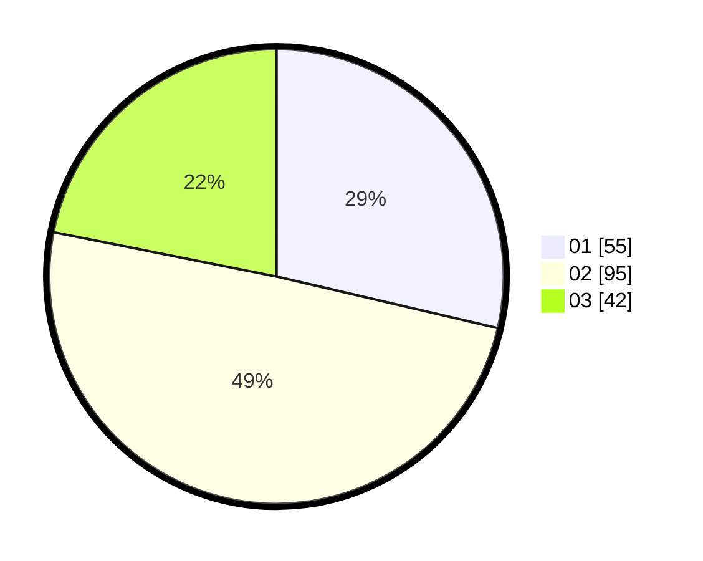

# Hasil

Hasil perolehan suara paslon dapat dilihat pada file paslon-01.txt, paslon-02.txt, dan paslon-03.txt.

Jika tidak ada, artinya data tersebut belum ada pada SIREKAP.

## Perolehan Suara

 * Paslon 01: **55**.
 * Paslon 02: **95**.
 * Paslon 03: **42**.

## Foto C Plano

https://sirekap-obj-formc.kpu.go.id/60e1/pemilu/ppwp/31/74/05/10/03/3174051003040-20240218-105043--d061edc5-41db-4472-ae62-3dc78d4af5ac.jpg

https://sirekap-obj-formc.kpu.go.id/60e1/pemilu/ppwp/31/74/05/10/03/3174051003040-20240218-105237--9baf643f-214c-4c9f-b0bb-267d1d5233bf.jpg

https://sirekap-obj-formc.kpu.go.id/60e1/pemilu/ppwp/31/74/05/10/03/3174051003040-20240218-105158--0497f27b-1d46-4e92-9446-94803c3e9c9b.jpg

## DATA PEMILIH TETAP

Jumlah pemilih dalam DPT: **268**.
 * L: **129**.
 * P: **139**.

## DATA PENGGUNA HAK PILIH

Jumlah pengguna hak pilih dalam DPT: **208**.
 * L: **74**.
 * P: **114**.

Jumlah pengguna hak pilih dalam DPTb: **1**.
 * L: **1**.
 * P: **0**.

Jumlah pengguna hak pilih dalam DPK: **0**.
 * L: **0**.
 * P: **0**.

Jumlah pengguna hak pilih: **209**.
 * L: **95**.
 * P: **114**.

## JUMLAH SUARA SAH DAN TIDAK SAH

JUMLAH SELURUH SUARA SAH: **203**.

JUMLAH SUARA TIDAK SAH: **6**.

JUMLAH SELURUH SUARA SAH DAN SUARA TIDAK SAH: **209**.
