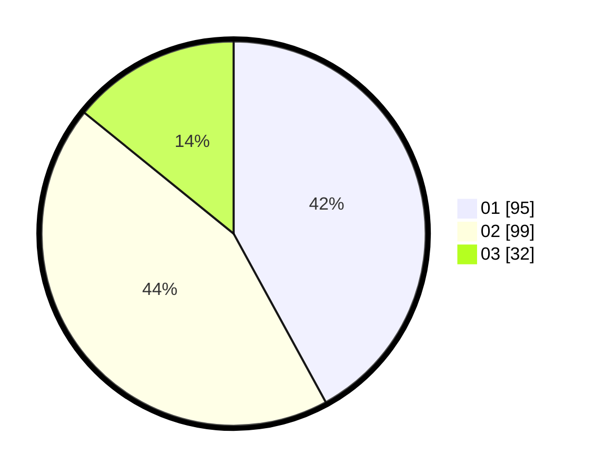

# Hasil

Hasil perolehan suara paslon dapat dilihat pada file paslon-01.txt, paslon-02.txt, dan paslon-03.txt.

Jika tidak ada, artinya data tersebut belum ada pada SIREKAP.

## Perolehan Suara

 * Paslon 01: **95**.
 * Paslon 02: **99**.
 * Paslon 03: **32**.

## Foto C Plano

https://sirekap-obj-formc.kpu.go.id/47e0/pemilu/ppwp/31/74/05/10/03/3174051003042-20240214-155810--dcb8e359-1a86-4ded-bcf1-b2584373df39.jpg

https://sirekap-obj-formc.kpu.go.id/47e0/pemilu/ppwp/31/74/05/10/03/3174051003042-20240214-155205--ce19eafa-30aa-4e90-a95f-517796ef6c92.jpg
