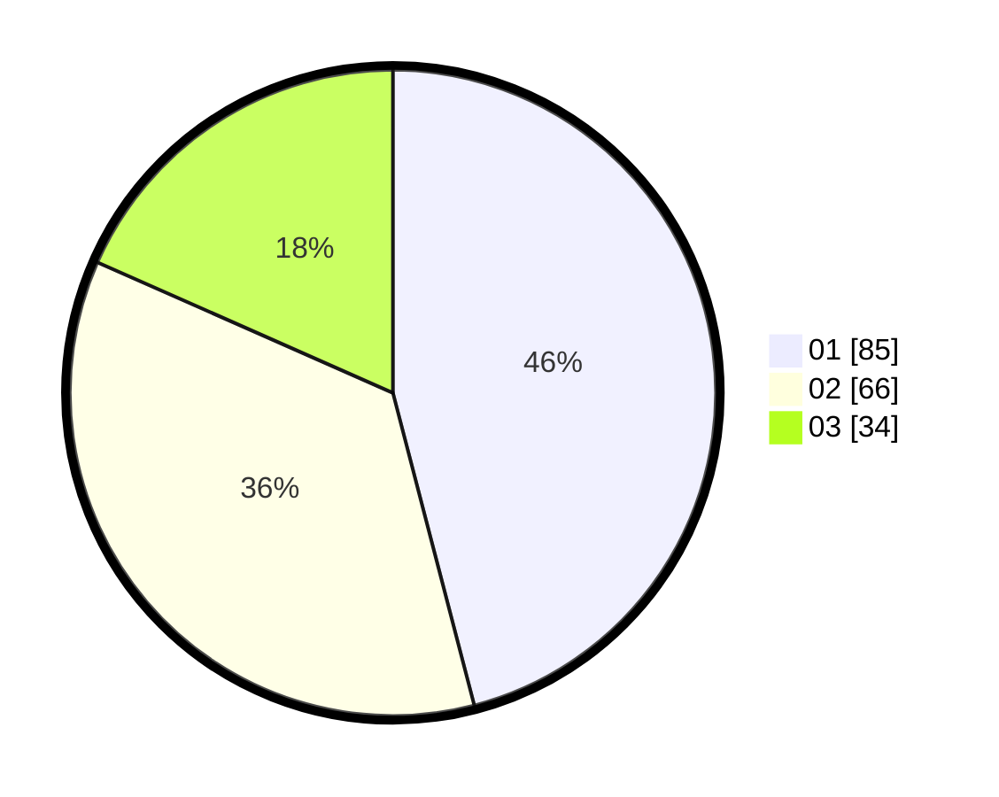

# Hasil

Hasil perolehan suara paslon dapat dilihat pada file paslon-01.txt, paslon-02.txt, dan paslon-03.txt.

Jika tidak ada, artinya data tersebut belum ada pada SIREKAP.

## Perolehan Suara

 * Paslon 01: **85**.
 * Paslon 02: **66**.
 * Paslon 03: **34**.

## Foto C Plano

https://sirekap-obj-formc.kpu.go.id/a9a3/pemilu/ppwp/31/74/05/10/03/3174051003056-20240214-192713--4bf3e318-0ea3-4ec8-86d5-68305a777d2a.jpg

https://sirekap-obj-formc.kpu.go.id/a9a3/pemilu/ppwp/31/74/05/10/03/3174051003056-20240214-193212--66923745-e105-4987-8366-e1c99800dbdf.jpg

https://sirekap-obj-formc.kpu.go.id/a9a3/pemilu/ppwp/31/74/05/10/03/3174051003056-20240214-192536--98e2655e-da93-47c1-b887-5a09413540fe.jpg

## DATA PEMILIH TETAP

Jumlah pemilih dalam DPT: **238**.
 * L: **122**.
 * P: **116**.

## DATA PENGGUNA HAK PILIH

Jumlah pengguna hak pilih dalam DPT: **182**.
 * L: **92**.
 * P: **90**.

Jumlah pengguna hak pilih dalam DPTb: **2**.
 * L: **0**.
 * P: **2**.

Jumlah pengguna hak pilih dalam DPK: **2**.
 * L: **0**.
 * P: **2**.

Jumlah pengguna hak pilih: **186**.
 * L: **93**.
 * P: **94**.

## JUMLAH SUARA SAH DAN TIDAK SAH

JUMLAH SELURUH SUARA SAH: **185**.

JUMLAH SUARA TIDAK SAH: **1**.

JUMLAH SELURUH SUARA SAH DAN SUARA TIDAK SAH: **186**.
