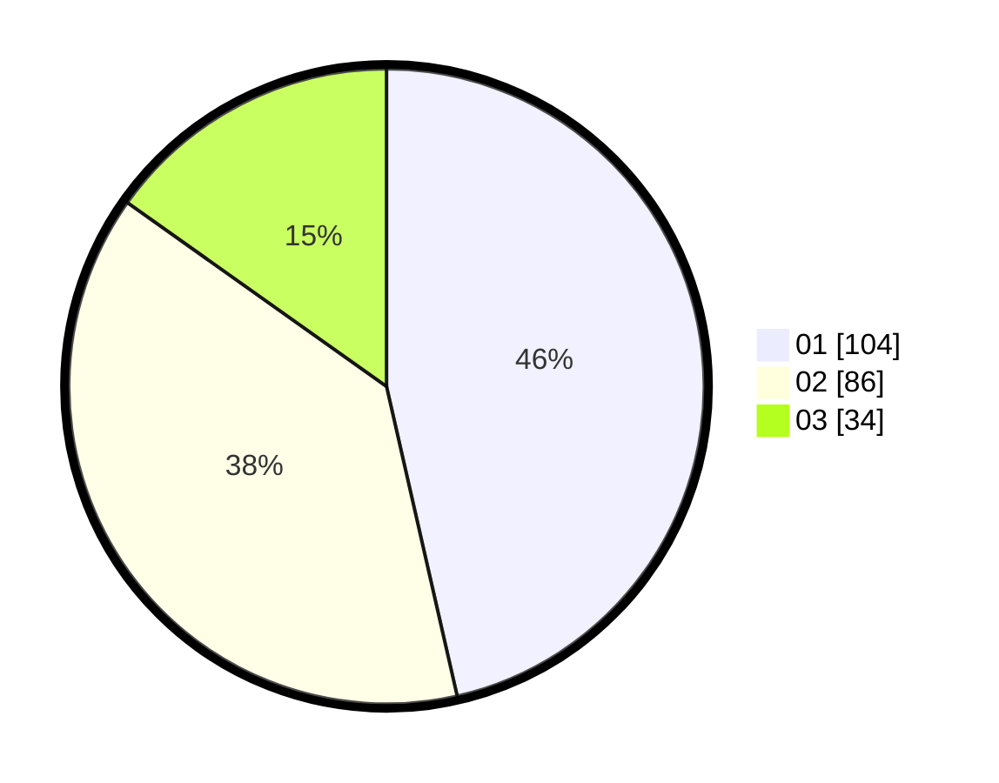

# Hasil

Hasil perolehan suara paslon dapat dilihat pada file paslon-01.txt, paslon-02.txt, dan paslon-03.txt.

Jika tidak ada, artinya data tersebut belum ada pada SIREKAP.

## Perolehan Suara

 * Paslon 01: **104**.
 * Paslon 02: **86**.
 * Paslon 03: **34**.

## Foto C Plano

https://sirekap-obj-formc.kpu.go.id/6ad3/pemilu/ppwp/31/74/05/10/03/3174051003071-20240214-155059--48261312-8e76-44f4-be00-f08549aa321f.jpg

https://sirekap-obj-formc.kpu.go.id/6ad3/pemilu/ppwp/31/74/05/10/03/3174051003071-20240214-155324--68b5d333-38dd-484b-bb42-7d2566c4bc5e.jpg

https://sirekap-obj-formc.kpu.go.id/6ad3/pemilu/ppwp/31/74/05/10/03/3174051003071-20240214-155421--2c9b47ae-ddfb-4a9e-9a44-b918c7eacd8c.jpg

## DATA PEMILIH TETAP

Jumlah pemilih dalam DPT: **277**.
 * L: **136**.
 * P: **141**.

## DATA PENGGUNA HAK PILIH

Jumlah pengguna hak pilih dalam DPT: **221**.
 * L: **104**.
 * P: **117**.

Jumlah pengguna hak pilih dalam DPTb: **1**.
 * L: **1**.
 * P: **0**.

Jumlah pengguna hak pilih dalam DPK: **3**.
 * L: **1**.
 * P: **0**.

Jumlah pengguna hak pilih: **225**.
 * L: **406**.
 * P: **119**.

## JUMLAH SUARA SAH DAN TIDAK SAH

JUMLAH SELURUH SUARA SAH: **224**.

JUMLAH SUARA TIDAK SAH: **1**.

JUMLAH SELURUH SUARA SAH DAN SUARA TIDAK SAH: **225**.
