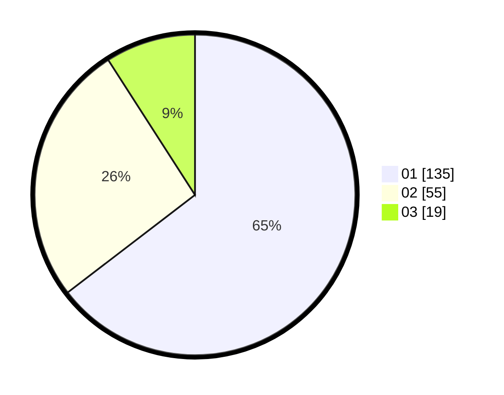

# Hasil

Hasil perolehan suara paslon dapat dilihat pada file paslon-01.txt, paslon-02.txt, dan paslon-03.txt.

Jika tidak ada, artinya data tersebut belum ada pada SIREKAP.

## Perolehan Suara

 * Paslon 01: **135**.
 * Paslon 02: **55**.
 * Paslon 03: **19**.

## Foto C Plano

https://sirekap-obj-formc.kpu.go.id/8746/pemilu/ppwp/31/74/05/10/03/3174051003080-20240216-144644--12a96f5d-a3ea-429c-94ec-f4ef4c7c9e89.jpg

https://sirekap-obj-formc.kpu.go.id/8746/pemilu/ppwp/31/74/05/10/03/3174051003080-20240216-144645--a41e9910-f876-4577-ab33-cef1e5665c24.jpg

https://sirekap-obj-formc.kpu.go.id/8746/pemilu/ppwp/31/74/05/10/03/3174051003080-20240216-144644--0667ba14-7c33-4cab-adca-eb220107fa8b.jpg

## DATA PEMILIH TETAP

Jumlah pemilih dalam DPT: **266**.
 * L: **130**.
 * P: **136**.

## DATA PENGGUNA HAK PILIH

Jumlah pengguna hak pilih dalam DPT: **202**.
 * L: **97**.
 * P: **105**.

Jumlah pengguna hak pilih dalam DPTb: **16**.
 * L: **8**.
 * P: **8**.

Jumlah pengguna hak pilih dalam DPK: **0**.
 * L: **1**.
 * P: **0**.

Jumlah pengguna hak pilih: **219**.
 * L: **106**.
 * P: **113**.

## JUMLAH SUARA SAH DAN TIDAK SAH

JUMLAH SELURUH SUARA SAH: **209**.

JUMLAH SUARA TIDAK SAH: **10**.

JUMLAH SELURUH SUARA SAH DAN SUARA TIDAK SAH: **219**.
