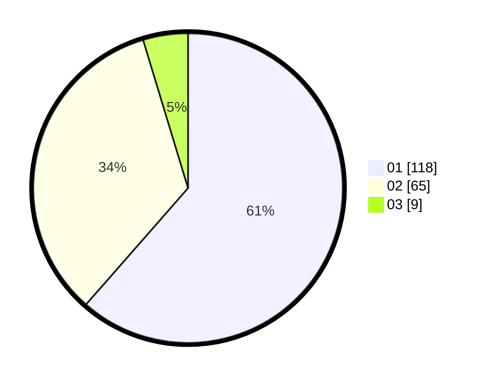

# Hasil

Hasil perolehan suara paslon dapat dilihat pada file paslon-01.txt, paslon-02.txt, dan paslon-03.txt.

Jika tidak ada, artinya data tersebut belum ada pada SIREKAP.

## Perolehan Suara

 * Paslon 01: **118**.
 * Paslon 02: **65**.
 * Paslon 03: **9**.

## Foto C Plano

https://sirekap-obj-formc.kpu.go.id/8ea4/pemilu/ppwp/31/74/05/10/03/3174051003082-20240214-184729--e983a2c3-d9e0-4ed0-b497-36d0e8b7a3bc.jpg

https://sirekap-obj-formc.kpu.go.id/8ea4/pemilu/ppwp/31/74/05/10/03/3174051003082-20240214-204003--7208acf6-0e59-42a3-bc8b-d96477f47fb5.jpg

https://sirekap-obj-formc.kpu.go.id/8ea4/pemilu/ppwp/31/74/05/10/03/3174051003082-20240214-204058--61ae4029-cacf-4515-9fea-b6e7f1b3628d.jpg

## DATA PEMILIH TETAP

Jumlah pemilih dalam DPT: **248**.
 * L: **127**.
 * P: **121**.

## DATA PENGGUNA HAK PILIH

Jumlah pengguna hak pilih dalam DPT: **194**.
 * L: **98**.
 * P: **96**.

Jumlah pengguna hak pilih dalam DPTb: **0**.
 * L: **0**.
 * P: **0**.

Jumlah pengguna hak pilih dalam DPK: **1**.
 * L: **0**.
 * P: **1**.

Jumlah pengguna hak pilih: **195**.
 * L: **98**.
 * P: **97**.

## JUMLAH SUARA SAH DAN TIDAK SAH

JUMLAH SELURUH SUARA SAH: **192**.

JUMLAH SUARA TIDAK SAH: **3**.

JUMLAH SELURUH SUARA SAH DAN SUARA TIDAK SAH: **195**.
