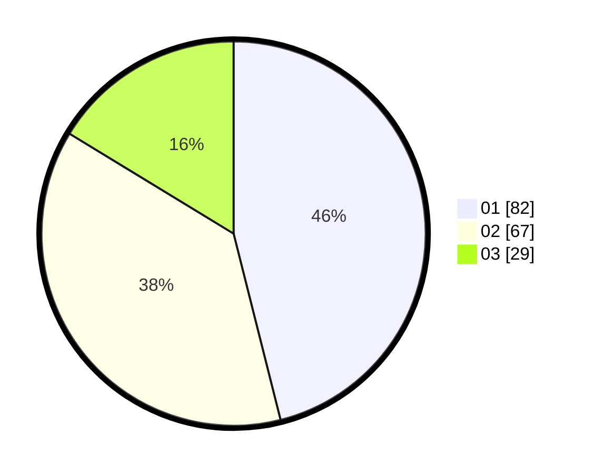

# Hasil

Hasil perolehan suara paslon dapat dilihat pada file paslon-01.txt, paslon-02.txt, dan paslon-03.txt.

Jika tidak ada, artinya data tersebut belum ada pada SIREKAP.

## Perolehan Suara

 * Paslon 01: **82**.
 * Paslon 02: **67**.
 * Paslon 03: **29**.

## Foto C Plano

https://sirekap-obj-formc.kpu.go.id/1380/pemilu/ppwp/31/74/05/10/03/3174051003091-20240215-123323--c24d6dff-849e-4861-87df-c5061e9709ba.jpg

https://sirekap-obj-formc.kpu.go.id/1380/pemilu/ppwp/31/74/05/10/03/3174051003091-20240215-123345--435e6643-bdc3-4c39-a6eb-e926494f96db.jpg

https://sirekap-obj-formc.kpu.go.id/1380/pemilu/ppwp/31/74/05/10/03/3174051003091-20240215-123334--92e98a99-0f4e-4041-9867-ac72cfa765b9.jpg

## DATA PEMILIH TETAP

Jumlah pemilih dalam DPT: **260**.
 * L: **133**.
 * P: **127**.

## DATA PENGGUNA HAK PILIH

Jumlah pengguna hak pilih dalam DPT: **177**.
 * L: **80**.
 * P: **97**.

Jumlah pengguna hak pilih dalam DPTb: **0**.
 * L: **0**.
 * P: **0**.

Jumlah pengguna hak pilih dalam DPK: **2**.
 * L: **1**.
 * P: **1**.

Jumlah pengguna hak pilih: **179**.
 * L: **81**.
 * P: **98**.

## JUMLAH SUARA SAH DAN TIDAK SAH

JUMLAH SELURUH SUARA SAH: **178**.

JUMLAH SUARA TIDAK SAH: **1**.

JUMLAH SELURUH SUARA SAH DAN SUARA TIDAK SAH: **179**.
