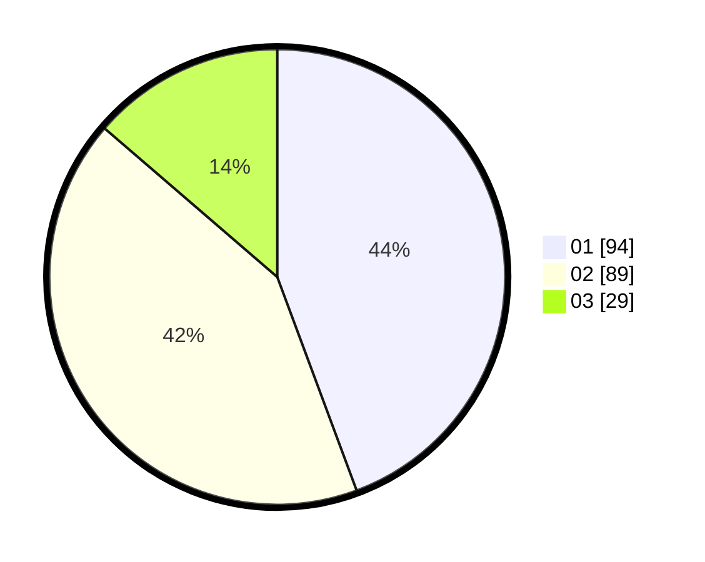

# Hasil

Hasil perolehan suara paslon dapat dilihat pada file paslon-01.txt, paslon-02.txt, dan paslon-03.txt.

Jika tidak ada, artinya data tersebut belum ada pada SIREKAP.

## Perolehan Suara

 * Paslon 01: **94**.
 * Paslon 02: **89**.
 * Paslon 03: **29**.

## Foto C Plano

https://sirekap-obj-formc.kpu.go.id/90c6/pemilu/ppwp/31/74/05/10/03/3174051003093-20240214-155456--8324d4f3-9e1a-4a95-9d0e-1fc7ae52756f.jpg

https://sirekap-obj-formc.kpu.go.id/90c6/pemilu/ppwp/31/74/05/10/03/3174051003093-20240214-155138--0f4beb7c-9c86-4399-ad2b-6eff0eed057e.jpg

https://sirekap-obj-formc.kpu.go.id/90c6/pemilu/ppwp/31/74/05/10/03/3174051003093-20240214-155307--d011aada-9573-4831-a1ab-a86b2ae889aa.jpg

## DATA PEMILIH TETAP

Jumlah pemilih dalam DPT: **280**.
 * L: **138**.
 * P: **142**.

## DATA PENGGUNA HAK PILIH

Jumlah pengguna hak pilih dalam DPT: **213**.
 * L: **98**.
 * P: **115**.

Jumlah pengguna hak pilih dalam DPTb: **0**.
 * L: **0**.
 * P: **0**.

Jumlah pengguna hak pilih dalam DPK: **0**.
 * L: **0**.
 * P: **0**.

Jumlah pengguna hak pilih: **213**.
 * L: **98**.
 * P: **115**.

## JUMLAH SUARA SAH DAN TIDAK SAH

JUMLAH SELURUH SUARA SAH: **212**.

JUMLAH SUARA TIDAK SAH: **1**.

JUMLAH SELURUH SUARA SAH DAN SUARA TIDAK SAH: **213**.
