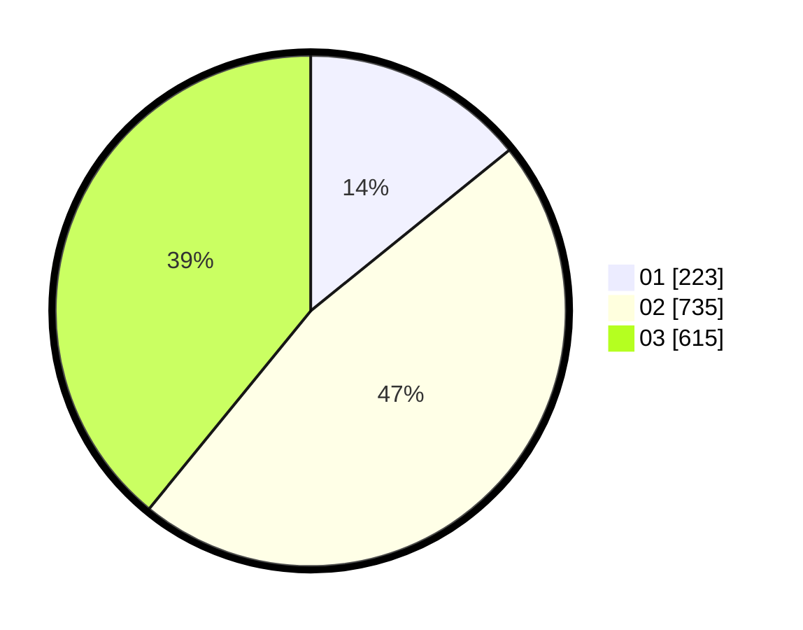

# Hasil

Hasil perolehan suara paslon dapat dilihat pada file paslon-01.txt, paslon-02.txt, dan paslon-03.txt.

Jika tidak ada, artinya data tersebut belum ada pada SIREKAP.

## Perolehan Suara

 * Paslon 01: **223**.
 * Paslon 02: **735**.
 * Paslon 03: **615**.

## Foto C Plano

https://sirekap-obj-formc.kpu.go.id/467e/pemilu/ppwp/31/74/05/10/03/3174051003100-20240219-034957--1b059826-2e86-483f-b395-cdd0edbce474.jpg

https://sirekap-obj-formc.kpu.go.id/467e/pemilu/ppwp/31/74/05/10/03/3174051003100-20240219-040034--984c17fa-83f7-4499-a912-c637c9b706ba.jpg

https://sirekap-obj-formc.kpu.go.id/467e/pemilu/ppwp/31/74/05/10/03/3174051003100-20240219-041121--8c17de74-9b15-44d8-9422-5019b37268e6.jpg

## DATA PEMILIH TETAP

Jumlah pemilih dalam DPT: **279**.
 * L: **129**.
 * P: **150**.

## DATA PENGGUNA HAK PILIH

Jumlah pengguna hak pilih dalam DPT: **217**.
 * L: **101**.
 * P: **116**.

Jumlah pengguna hak pilih dalam DPTb: **3**.
 * L: **1**.
 * P: **2**.

Jumlah pengguna hak pilih dalam DPK: **4**.
 * L: **3**.
 * P: **1**.

Jumlah pengguna hak pilih: **224**.
 * L: **105**.
 * P: **119**.

## JUMLAH SUARA SAH DAN TIDAK SAH

JUMLAH SELURUH SUARA SAH: **215**.

JUMLAH SUARA TIDAK SAH: **9**.

JUMLAH SELURUH SUARA SAH DAN SUARA TIDAK SAH: **224**.
