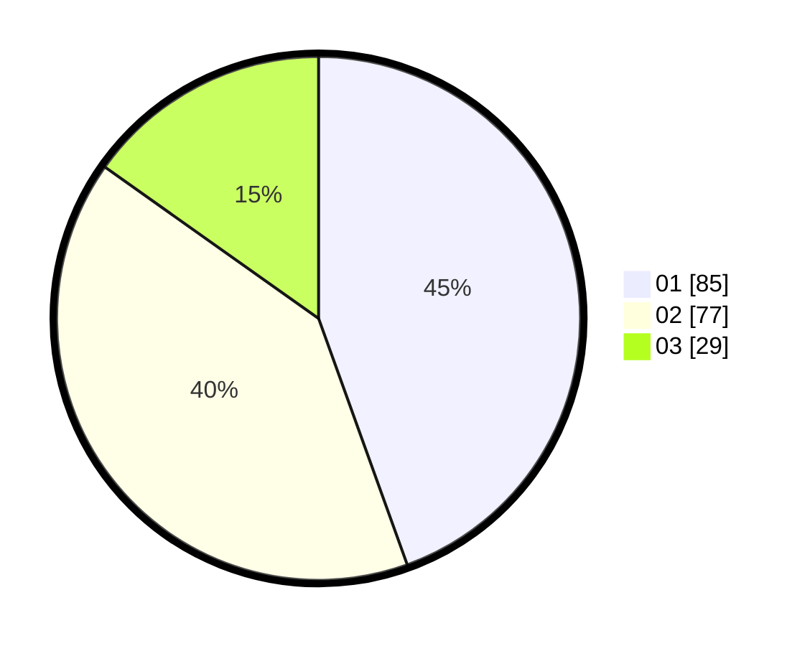

# Hasil

Hasil perolehan suara paslon dapat dilihat pada file paslon-01.txt, paslon-02.txt, dan paslon-03.txt.

Jika tidak ada, artinya data tersebut belum ada pada SIREKAP.

## Perolehan Suara

 * Paslon 01: **85**.
 * Paslon 02: **77**.
 * Paslon 03: **29**.

## Foto C Plano

https://sirekap-obj-formc.kpu.go.id/951f/pemilu/ppwp/31/74/05/10/03/3174051003101-20240214-234836--46e285a4-e5c3-412e-bdf0-34da9f4ce490.jpg

https://sirekap-obj-formc.kpu.go.id/951f/pemilu/ppwp/31/74/05/10/03/3174051003101-20240214-200430--cda907f9-38c7-4485-9380-08a1f6ac00ad.jpg

https://sirekap-obj-formc.kpu.go.id/951f/pemilu/ppwp/31/74/05/10/03/3174051003101-20240214-200552--4efa5148-f79f-4304-b866-370b034ce5cf.jpg
