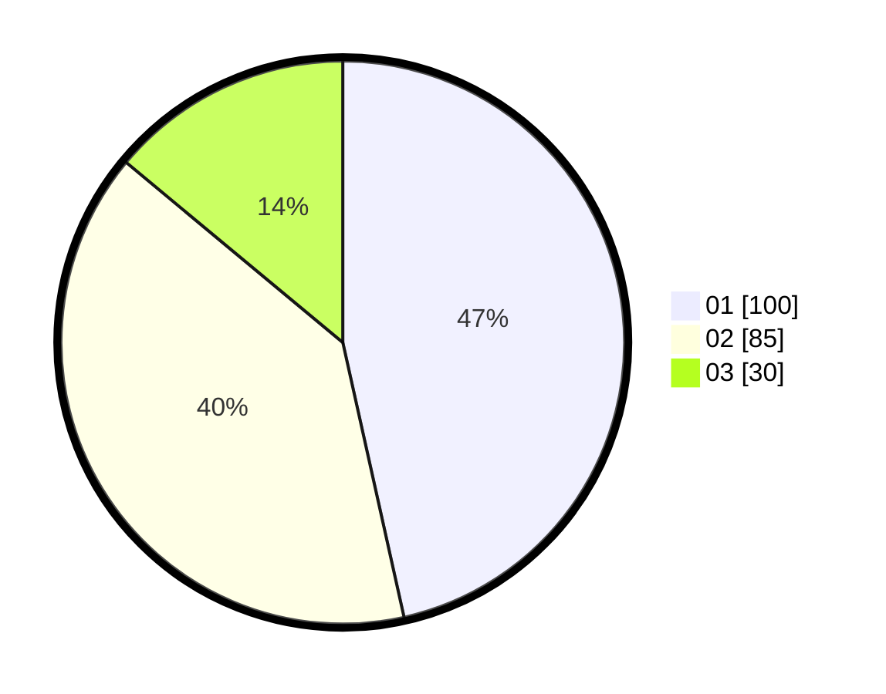

# Hasil

Hasil perolehan suara paslon dapat dilihat pada file paslon-01.txt, paslon-02.txt, dan paslon-03.txt.

Jika tidak ada, artinya data tersebut belum ada pada SIREKAP.

## Perolehan Suara

 * Paslon 01: **100**.
 * Paslon 02: **85**.
 * Paslon 03: **30**.

## Foto C Plano

https://sirekap-obj-formc.kpu.go.id/2ef8/pemilu/ppwp/31/74/05/10/03/3174051003110-20240214-204455--ba3f7277-361d-4337-885b-68826f39b49e.jpg

https://sirekap-obj-formc.kpu.go.id/2ef8/pemilu/ppwp/31/74/05/10/03/3174051003110-20240214-204503--ce74ff37-2fea-42a1-8f30-88d9d8c385cb.jpg

https://sirekap-obj-formc.kpu.go.id/2ef8/pemilu/ppwp/31/74/05/10/03/3174051003110-20240214-204509--879113b8-86cf-46e7-9bf4-3e12838a9ff4.jpg

## DATA PEMILIH TETAP

Jumlah pemilih dalam DPT: **276**.
 * L: **134**.
 * P: **142**.

## DATA PENGGUNA HAK PILIH

Jumlah pengguna hak pilih dalam DPT: **215**.
 * L: **100**.
 * P: **115**.

Jumlah pengguna hak pilih dalam DPTb: **0**.
 * L: **0**.
 * P: **0**.

Jumlah pengguna hak pilih dalam DPK: **2**.
 * L: **0**.
 * P: **2**.

Jumlah pengguna hak pilih: **217**.
 * L: **100**.
 * P: **117**.

## JUMLAH SUARA SAH DAN TIDAK SAH

JUMLAH SELURUH SUARA SAH: **215**.

JUMLAH SUARA TIDAK SAH: **2**.

JUMLAH SELURUH SUARA SAH DAN SUARA TIDAK SAH: **217**.
