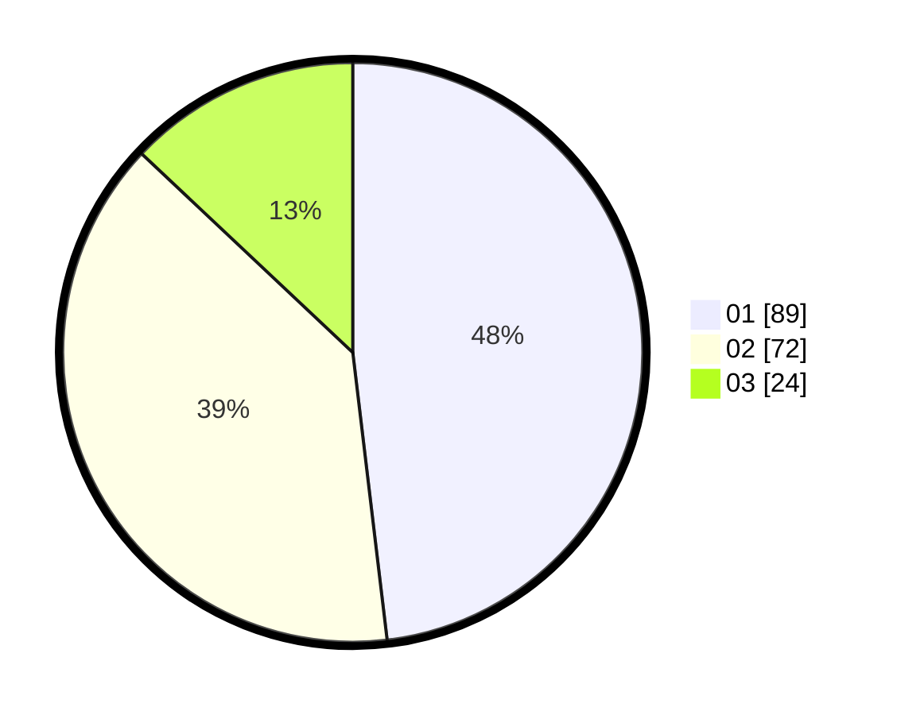

# Hasil

Hasil perolehan suara paslon dapat dilihat pada file paslon-01.txt, paslon-02.txt, dan paslon-03.txt.

Jika tidak ada, artinya data tersebut belum ada pada SIREKAP.

## Perolehan Suara

 * Paslon 01: **89**.
 * Paslon 02: **72**.
 * Paslon 03: **24**.

## Foto C Plano

https://sirekap-obj-formc.kpu.go.id/cee6/pemilu/ppwp/31/74/05/10/03/3174051003117-20240216-145753--fd62f6ec-fd5e-47b8-98f6-b0d58d49c773.jpg

https://sirekap-obj-formc.kpu.go.id/cee6/pemilu/ppwp/31/74/05/10/03/3174051003117-20240216-145754--dc334a6e-7186-4b78-b76e-7133a8b158e5.jpg

https://sirekap-obj-formc.kpu.go.id/cee6/pemilu/ppwp/31/74/05/10/03/3174051003117-20240216-145753--9ee293a4-e394-4437-b092-660506ccfadb.jpg

## DATA PEMILIH TETAP

Jumlah pemilih dalam DPT: **247**.
 * L: **125**.
 * P: **122**.

## DATA PENGGUNA HAK PILIH

Jumlah pengguna hak pilih dalam DPT: **183**.
 * L: **94**.
 * P: **89**.

Jumlah pengguna hak pilih dalam DPTb: **2**.
 * L: **1**.
 * P: **1**.

Jumlah pengguna hak pilih dalam DPK: **0**.
 * L: **0**.
 * P: **0**.

Jumlah pengguna hak pilih: **185**.
 * L: **95**.
 * P: **90**.

## JUMLAH SUARA SAH DAN TIDAK SAH

JUMLAH SELURUH SUARA SAH: **185**.

JUMLAH SUARA TIDAK SAH: **0**.

JUMLAH SELURUH SUARA SAH DAN SUARA TIDAK SAH: **185**.
