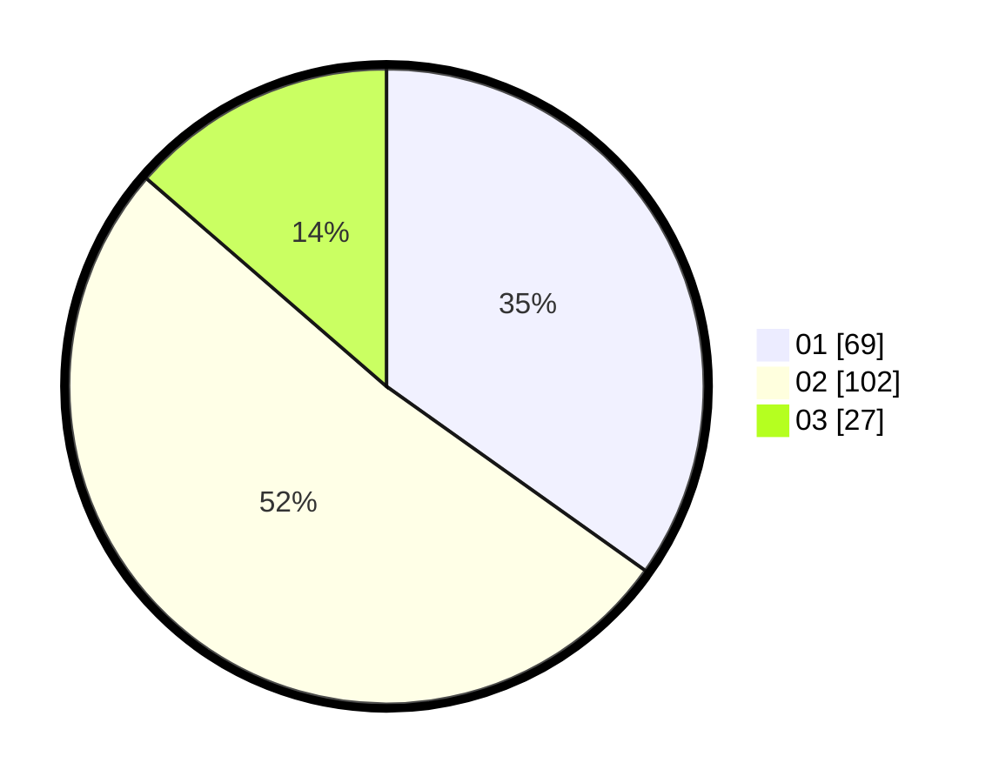

# Hasil

Hasil perolehan suara paslon dapat dilihat pada file paslon-01.txt, paslon-02.txt, dan paslon-03.txt.

Jika tidak ada, artinya data tersebut belum ada pada SIREKAP.

## Perolehan Suara

 * Paslon 01: **69**.
 * Paslon 02: **102**.
 * Paslon 03: **27**.

## Foto C Plano

https://sirekap-obj-formc.kpu.go.id/55b3/pemilu/ppwp/31/74/05/10/03/3174051003119-20240214-185721--1c7930da-c0de-47a0-a94b-2076cff3c24f.jpg

https://sirekap-obj-formc.kpu.go.id/55b3/pemilu/ppwp/31/74/05/10/03/3174051003119-20240214-185714--820bde9c-481e-489d-af02-cae99e87c2bc.jpg

https://sirekap-obj-formc.kpu.go.id/55b3/pemilu/ppwp/31/74/05/10/03/3174051003119-20240214-155211--6493b57a-d4bc-45dc-8d75-c065b1463fd1.jpg

## DATA PEMILIH TETAP

Jumlah pemilih dalam DPT: **243**.
 * L: **126**.
 * P: **117**.

## DATA PENGGUNA HAK PILIH

Jumlah pengguna hak pilih dalam DPT: **207**.
 * L: **104**.
 * P: **103**.

Jumlah pengguna hak pilih dalam DPTb: **1**.
 * L: **1**.
 * P: **0**.

Jumlah pengguna hak pilih dalam DPK: **3**.
 * L: **1**.
 * P: **2**.

Jumlah pengguna hak pilih: **211**.
 * L: **106**.
 * P: **105**.

## JUMLAH SUARA SAH DAN TIDAK SAH

JUMLAH SELURUH SUARA SAH: **198**.

JUMLAH SUARA TIDAK SAH: **13**.

JUMLAH SELURUH SUARA SAH DAN SUARA TIDAK SAH: **211**.
