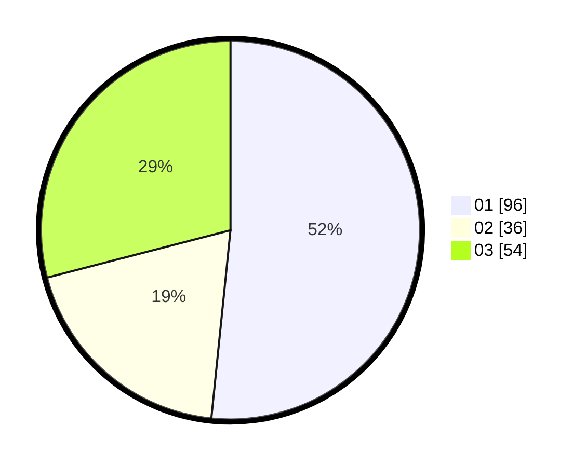

# Hasil

Hasil perolehan suara paslon dapat dilihat pada file paslon-01.txt, paslon-02.txt, dan paslon-03.txt.

Jika tidak ada, artinya data tersebut belum ada pada SIREKAP.

## Perolehan Suara

 * Paslon 01: **96**.
 * Paslon 02: **36**.
 * Paslon 03: **54**.

## Foto C Plano

https://sirekap-obj-formc.kpu.go.id/e21d/pemilu/ppwp/31/74/05/10/03/3174051003125-20240214-202004--0d07a799-cdf1-4c3d-827b-3fe0b45afeb3.jpg

https://sirekap-obj-formc.kpu.go.id/e21d/pemilu/ppwp/31/74/05/10/03/3174051003125-20240214-193036--4a1f9502-c2df-4bd1-9da0-8cf49787f54d.jpg

https://sirekap-obj-formc.kpu.go.id/e21d/pemilu/ppwp/31/74/05/10/03/3174051003125-20240214-193047--4fbaed1a-67f2-484a-a401-a9e0199c046a.jpg

## DATA PEMILIH TETAP

Jumlah pemilih dalam DPT: **217**.
 * L: **98**.
 * P: **119**.

## DATA PENGGUNA HAK PILIH

Jumlah pengguna hak pilih dalam DPT: **184**.
 * L: **78**.
 * P: **106**.

Jumlah pengguna hak pilih dalam DPTb: **3**.
 * L: **0**.
 * P: **3**.

Jumlah pengguna hak pilih dalam DPK: **4**.
 * L: **2**.
 * P: **2**.

Jumlah pengguna hak pilih: **191**.
 * L: **80**.
 * P: **111**.

## JUMLAH SUARA SAH DAN TIDAK SAH

JUMLAH SELURUH SUARA SAH: **186**.

JUMLAH SUARA TIDAK SAH: **5**.

JUMLAH SELURUH SUARA SAH DAN SUARA TIDAK SAH: **191**.
