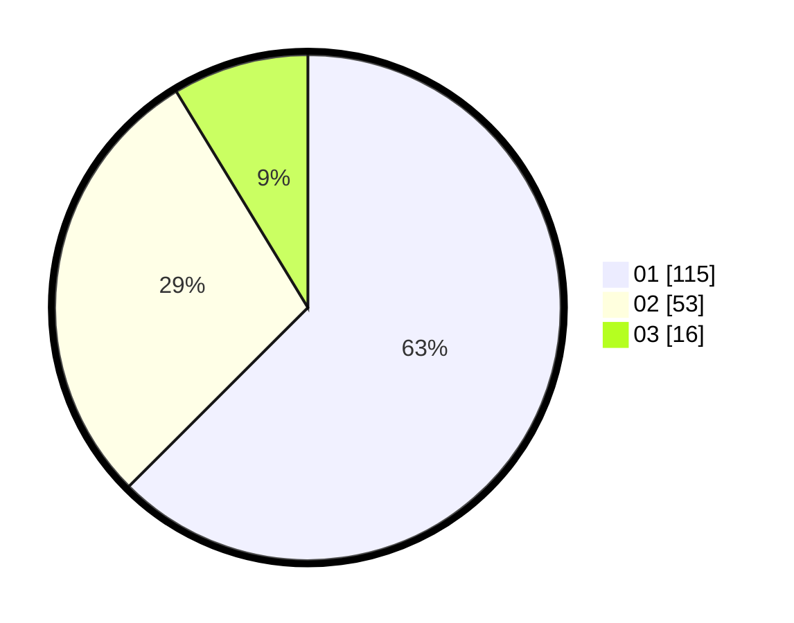

# Hasil

Hasil perolehan suara paslon dapat dilihat pada file paslon-01.txt, paslon-02.txt, dan paslon-03.txt.

Jika tidak ada, artinya data tersebut belum ada pada SIREKAP.

## Perolehan Suara

 * Paslon 01: **115**.
 * Paslon 02: **53**.
 * Paslon 03: **16**.

## Foto C Plano

https://sirekap-obj-formc.kpu.go.id/6dcb/pemilu/ppwp/31/74/05/10/03/3174051003135-20240218-195337--9e60c5b1-f082-43bb-8dc2-abdf7163ae21.jpg

https://sirekap-obj-formc.kpu.go.id/6dcb/pemilu/ppwp/31/74/05/10/03/3174051003135-20240218-200229--fda9bdf8-3fcd-4b5f-b2ba-5cabcae8f421.jpg

https://sirekap-obj-formc.kpu.go.id/6dcb/pemilu/ppwp/31/74/05/10/03/3174051003135-20240218-201210--94e0de00-d42d-4d7a-8a9c-e7e19ed53b6a.jpg

## DATA PEMILIH TETAP

Jumlah pemilih dalam DPT: **230**.
 * L: **114**.
 * P: **116**.

## DATA PENGGUNA HAK PILIH

Jumlah pengguna hak pilih dalam DPT: **191**.
 * L: **92**.
 * P: **99**.

Jumlah pengguna hak pilih dalam DPTb: **0**.
 * L: **0**.
 * P: **0**.

Jumlah pengguna hak pilih dalam DPK: **0**.
 * L: **0**.
 * P: **0**.

Jumlah pengguna hak pilih: **191**.
 * L: **92**.
 * P: **99**.

## JUMLAH SUARA SAH DAN TIDAK SAH

JUMLAH SELURUH SUARA SAH: **189**.

JUMLAH SUARA TIDAK SAH: **2**.

JUMLAH SELURUH SUARA SAH DAN SUARA TIDAK SAH: **191**.
