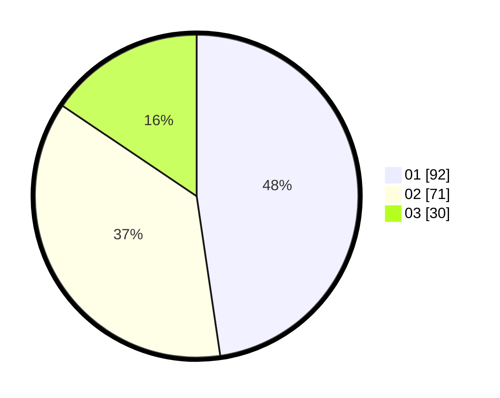

# Hasil

Hasil perolehan suara paslon dapat dilihat pada file paslon-01.txt, paslon-02.txt, dan paslon-03.txt.

Jika tidak ada, artinya data tersebut belum ada pada SIREKAP.

## Perolehan Suara

 * Paslon 01: **92**.
 * Paslon 02: **71**.
 * Paslon 03: **30**.

## Foto C Plano

https://sirekap-obj-formc.kpu.go.id/35e7/pemilu/ppwp/31/74/05/10/03/3174051003136-20240218-185349--010c378f-1c46-4184-beb9-d9bfe373a67f.jpg

https://sirekap-obj-formc.kpu.go.id/35e7/pemilu/ppwp/31/74/05/10/03/3174051003136-20240218-141451--1faf629e-bc09-47eb-b279-73dc2a1bcc72.jpg

https://sirekap-obj-formc.kpu.go.id/35e7/pemilu/ppwp/31/74/05/10/03/3174051003136-20240218-160628--f290e511-0160-445b-950a-52960edfcacd.jpg

## DATA PEMILIH TETAP

Jumlah pemilih dalam DPT: **230**.
 * L: **116**.
 * P: **114**.

## DATA PENGGUNA HAK PILIH

Jumlah pengguna hak pilih dalam DPT: **191**.
 * L: **94**.
 * P: **97**.

Jumlah pengguna hak pilih dalam DPTb: **1**.
 * L: **0**.
 * P: **1**.

Jumlah pengguna hak pilih dalam DPK: **3**.
 * L: **1**.
 * P: **2**.

Jumlah pengguna hak pilih: **195**.
 * L: **95**.
 * P: **100**.

## JUMLAH SUARA SAH DAN TIDAK SAH

JUMLAH SELURUH SUARA SAH: **193**.

JUMLAH SUARA TIDAK SAH: **2**.

JUMLAH SELURUH SUARA SAH DAN SUARA TIDAK SAH: **195**.
